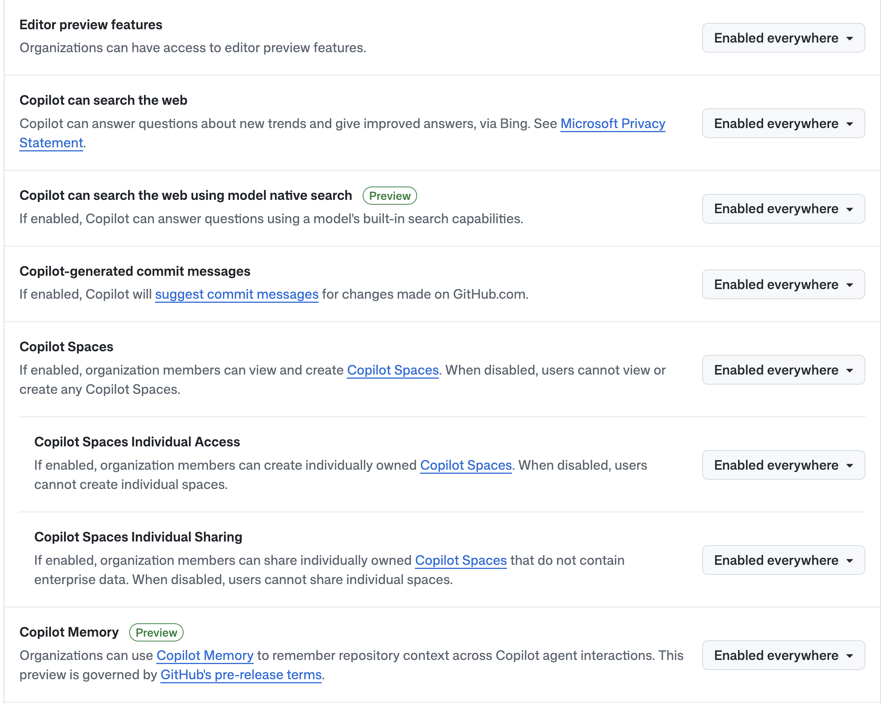
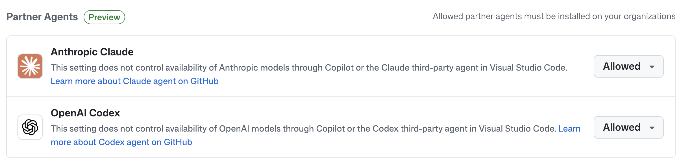
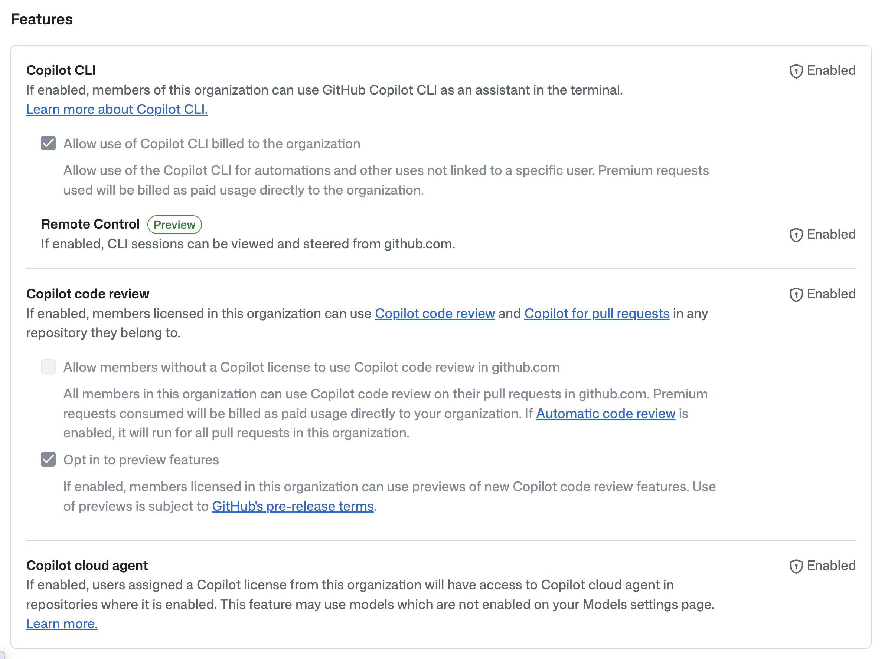
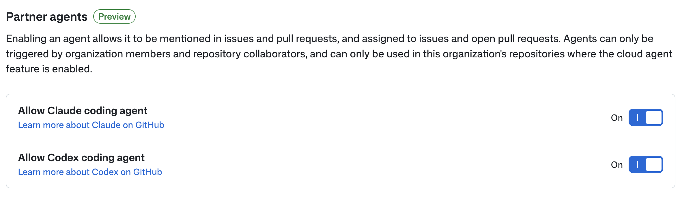
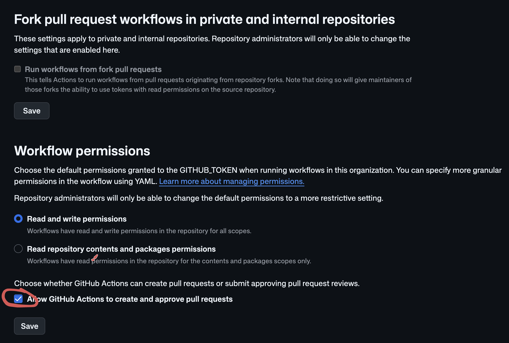

# 📋 講師向け：Organization 設定ガイド

企業の Organization でこのワークショップを実施する場合、以下の設定が必要です。

## 前提：サンドボックス Organization の準備

ワークショップ用に、できる限り多くの機能が有効化された **サンドボックス Organization** を用意してください。以下の機能が必要です：

- ✅ **GitHub Copilot**（Business または Enterprise）
- ✅ **Copilot CLI**
- ✅ **Copilot Cloud Agent**
- ✅ **Copilot Code Review**
- ✅ **Partner Agents**（Claude、Codex 等）
- ✅ **GitHub Codespaces**
- ✅ **GitHub Actions**
- ✅ **GitHub Advanced Security**（GHAS）

> 💡 参加者がリポジトリを自由に作成・操作できる環境が必要です。本番の Organization ではなく、ワークショップ専用のサンドボックスを推奨します。

以下、各設定の詳細を説明します。

---

## 0. Enterprise レベルの設定

**設定場所**: Enterprise Settings → AI Controls → Copilot → Features

以下の機能をすべて **Enabled everywhere** に設定してください：

- **Editor preview features** → Enabled everywhere
- **Copilot can search the web** → Enabled everywhere
- **Copilot can search the web using model native search** → Enabled everywhere
- **Copilot-generated commit messages** → Enabled everywhere
- **Copilot Spaces** → Enabled everywhere
- **Copilot Memory** → Enabled everywhere

> ⚠️ Enterprise レベルの設定は Organization の設定より優先されます。Enterprise 管理者に依頼してください。

**設定場所**: Enterprise Settings → AI Controls → Agents → Available Agents → Partner Agents

以下を **Allowed** に設定してください：

- **Anthropic Claude** → Allowed
- **OpenAI Codex** → Allowed

> 💡 **注意**: Allowed に設定した Partner Agents は、各 Organization にもインストールが必要です（Section 1 参照）。

---

## 1. Copilot の設定（Organization レベル）

**設定場所**: Organization Settings → Copilot → Policies → Features

以下の機能をすべて **Enabled** に設定してください：

- **Copilot CLI** → Enabled
  - ✅ Allow use of Copilot CLI billed to the organization
  - **Remote Control** → Enabled
- **Copilot code review** → Enabled
  - ✅ Opt in to preview features
- **Copilot cloud agent** → Enabled

**設定場所**: Organization Settings → Copilot → Cloud Agent → Partner Agents

以下を **On** に設定してください：

- **Allow Claude coding agent** → On
- **Allow Codex coding agent** → On

## 2. Codespaces の有効化

**設定場所**: Organization Settings → Code, planning, and automation → Codespaces

- **Enable for**: `All members` を選択
- **Ownership**: `Organization ownership` を選択

> ⚠️ Codespaces が無効の場合、参加者が Codespaces を起動できません。

### 💰 Codespaces の料金について

Codespaces の料金は **$0.18/hour**（2-core マシン）です。

| 項目 | 値 |
|---|---|
| 参加者数 | 300名 |
| ワークショップ時間 | 3時間 |
| 単価 | $0.18/hour |
| **合計概算** | **$162.00** |

> 📊 詳細な料金シミュレーションは [GitHub Pricing Calculator](https://github.com/pricing/calculator) をご利用ください。
>
> 💡 **ヒント**: Codespaces はアイドル状態で自動停止するため、実際の料金は上記より低くなる場合があります。Organization Settings で **idle timeout**（デフォルト30分）を設定し、コストを最適化できます。

## 3. GitHub Actions の設定

**設定場所**: Organization Settings → Actions → General → Workflow permissions

- **Read and write permissions** を選択
- ✅ **Allow GitHub Actions to create and approve pull requests** にチェック
- **Save** をクリック

