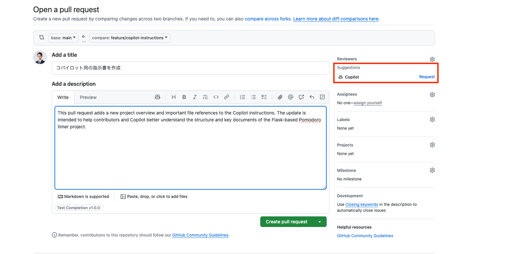
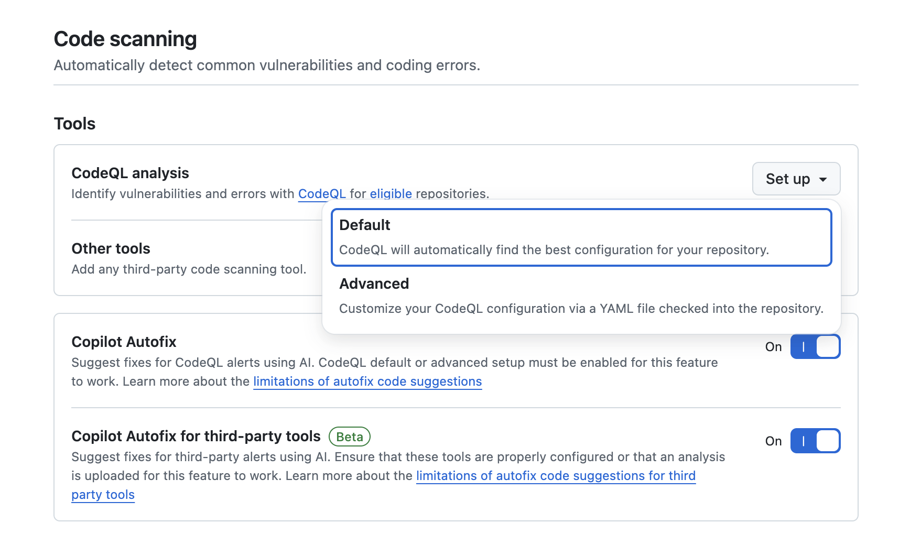

author: Theo Monfort
summary: Nikon GitHub Copilot ワークショップ
id: github-copilot-workshop
categories: AI, Development
environments: Web
status: Published
feedback link: https://example.com/feedback

# Nikon GitHub Copilot ワークショップ

## ワークショップについて
Duration: 5

GitHub Copilotワークショップへようこそ！


このワークショップでは、**2008年時代のレガシーPHPウェブサイト（ヒカリ / Hikari）** を題材に、GitHub Copilot の全機能を活用してモダンなウェブアプリケーションに変革する体験をしていただきます。

### 本日のゴール
- GitHub Copilot のセットアップとカスタマイズ方法を理解する
- Copilot Agent Mode でレガシーサイトを Next.js + TypeScript + Tailwind CSS に移行する
- 自動テスト、コード品質チェック、セキュリティスキャンを設定する
- Cloud Agent による自律的な機能実装を体験する
- Agentic Workflow で CI/CD パイプラインに AI を組み込む
- Copilot CLI で新規アプリケーションを構築する

### 本日のアジェンダ

| パート | 内容 | 概要 |
|---|---|---|
| Setup | プロジェクトセットアップ | テンプレートリポジトリから Codespaces を起動 |
| 1 | セットアップ＆カスタマイズ | /init、カスタム指示、Skill 作成、MCP 設定 |
| 2 | 実装：レガシーサイトの移行 | Plan Mode → Next.js + TypeScript + Tailwind への移行 |
| 3 | 自動テストと Actions | Vitest + Playwright テスト、CI ワークフロー |
| 4 | コード品質 | Copilot Code Review、GHAS 設定 |
| 5 | Cloud Agent | Issue からの自律的な機能実装 |
| 6 | Agentic Workflow | PAT 作成、テストカバレッジ自動更新 |
| 7 | CLI | AI 利用状況ダッシュボードの構築 |

### 前提条件

以下の**いずれか**の環境をご用意ください：

**オプション A: 個人環境**
- Visual Studio Code がインストールされていること
- GitHub Copilot のライセンスがあること（**Pro / Pro+ / Business / Enterprise** プラン推奨）
- GitHub アカウントを持っていること

> aside negative
> **⚠️ プランについて**: Free プランでも Agent Mode（Part 1〜2）は利用可能ですが、Cloud Agent（Part 5）、Agentic Workflow（Part 6）、自動 Code Review（Part 4）は **Pro プラン以上** が必要です。ワークショップの全パートを体験するには **Pro / Pro+ / Business / Enterprise** プランをご利用ください。

**オプション B: 企業環境（お客様向け）**
- 以下の機能が有効化されたプライベート Organization を持っていること：
  - GitHub Actions
  - GitHub Copilot（Pro+ / Business / Enterprise）
  - GitHub Advanced Security (GHAS)
- Organization 内でリポジトリを作成できる権限があること

## プロジェクトのセットアップ
Duration: 15

このワークショップでは、以下の GitHub リポジトリを使用します：

**プロジェクトURL**: https://github.com/theomonfort/2026-Github-Copilot-Workshop-Nodejs

### ステップ1: テンプレートからリポジトリを作成する

1. プロジェクト URL をブラウザで開く
2. 右上の **Use this template** ボタンをクリックし、**Create a new repository** を選択
3. リポジトリ作成画面で以下を設定：

#### Owner（オーナー）の選択

**個人で参加の場合：**
- Owner は **自分のアカウント** を選択
- Visibility は **Public** を選択（Free プランの場合、Public でないと一部機能が制限されます）

**企業の Organization で参加の場合：**
- Owner は **Copilot / Actions / GHAS / Codespaces などが有効化された Organization** を選択
- Visibility は **Private** を選択

#### Repository name（リポジトリ名）
- 任意の名前を入力してください（例: `hands-on-yourname`）

4. **Create repository** をクリック

### ステップ2: Codespaces で開発環境を起動する

1. 作成したリポジトリのページで、緑色の **Code** ボタンをクリック
2. **Codespaces** タブを選択
3. **Create codespace on main** をクリック


> aside positive
> **⏳ 注意**: Codespace の起動には数分かかる場合があります。DevContainer のビルドが完了するまでお待ちください。

DevContainer が自動的に Node.js 20 環境をセットアップし、以下が事前にインストールされます：
- GitHub Copilot & Copilot Chat 拡張機能
- Live Server 拡張機能（プレビュー用）
- GitHub CLI
- GitHub MCP Server（自動検出有効化済み）

### ステップ3: レガシーサイトを確認する

VS Code のターミナルを開き、以下のコマンドを実行してレガシーサイトを起動します：

```bash
cd hikari-legacy-php
php -S localhost:8080
```

Codespace がポート **8080** を自動検出し、**「Open in Browser」** のポップアップが表示されます。クリックしてブラウザでサイトを確認してください。

**これが今日のリファクタリング対象です。**

## セットアップ＆カスタマイズ
Duration: 20

### 1.1 — Copilot でリポジトリを理解する

まず、Copilot にこのリポジトリの全体像を把握させましょう。

> aside positive
> **💡 ヒント**: Codespaces で作業している場合、Copilot Chat の左下にある承認モードを **「Bypass Approvals」** に変更すると、ツール実行の承認をスキップでき、ワークショップをスムーズに進められます。

Copilot Chat で以下を実行します：

```
/init
```

`/init` コマンドにより、Copilot がリポジトリをスキャンし、`copilot-instructions.md` を自動生成します。

生成された内容を確認し、レガシー PHP サイトの構造が正しく認識されていることを確認してください。

> aside negative
> **気づきましたか？** Copilot の応答が**英語**で返ってきます。`copilot-instructions.md` に言語設定がないため、Copilot はデフォルトの英語で応答しています。次のステップでこれを修正しましょう。

> aside positive
> **ポイント**: プロジェクトの文脈を一度設定すれば、以降の作業で一貫した理解に基づくアシストが可能になります。

### 1.2 — カスタム指示を追加する

`/init` で生成された `copilot-instructions.md` を日本語化し、移行ガイドラインを追加しましょう。Copilot Chat で以下のプロンプトを入力してください：

```
copilot-instructions.md を日本語にして、以下の内容を追記してください。既存の内容は残してください。

- 言語設定: すべての会話は日本語で行う
- 移行先の技術スタック: Next.js (App Router) + TypeScript + Tailwind CSS
- テスト: Vitest + Playwright
- デザイン要件: モダンで洗練されたUI、レスポンシブデザイン（モバイルファースト）、ダークモード対応
- コーディング規約: ESLint + Prettier 準拠、関数コンポーネント + Hooks、型定義は厳格に（any 禁止）
```

> aside positive
> **ポイント**: `/init` で生成されたレガシーコードの説明を残しておくことで、Copilot は「現在の状態」と「移行先の目標」の両方を理解した上でアシストしてくれます。

### 1.3 — フロントエンド Skill を作成する

Copilot に以下のプロンプトを入力して、フロントエンド開発用の Skill を作成してもらいましょう。`[自社の会社名]` の部分を**実際の会社名に置き換えて**ください：

```
[自社の会社名] のブランディングに基づいたフロントエンド Skill を作成してください。
ウェブ上でリサーチを行い、ブランドカラー、タイポグラフィ、デザイン原則、コンポーネントパターンを定義してください。
Skill ファイルは .github/skills/ 配下に追加してください。
```

> aside negative
> **⚠️ 重要**: `[自社の会社名]` をそのまま入力しないでください。必ず実際の会社名（例: `Nikon`、`Sony`、`Toyota` など）に置き換えてください。

Copilot がウェブ上で会社のブランド情報をリサーチし、ブランドガイドラインに基づいた Skill ファイルを自動生成します。

### 1.4 — MCP Server を確認する

MCP（Model Context Protocol）Server が正しく接続されていることを確認しましょう。

#### GitHub MCP Server の確認

`.vscode/mcp.json` に GitHub MCP Server が設定されていることを確認します：

```json
{
  "servers": {
    "github-mcp-server": {
      "type": "http",
      "url": "https://api.githubcopilot.com/mcp/"
    }
  }
}
```

Copilot Chat で以下を入力して、GitHub との接続を確認します：

```
このリポジトリの情報を教えてください（リポジトリ名、Issue 一覧、最新コミット）
```

#### Playwright MCP Server の追加

テスト用に Playwright MCP Server を追加します。

1. Copilot Chat の入力欄にある **🔧 ツールボタン**（モデル選択の右側）をクリック
2. **「Add MCP Server」** を選択
3. **「Browse MCP Servers」** をクリック
4. 初回の場合は **「Enable MCP Servers Marketplace」** をクリックして有効化
5. **「Playwright」** で検索し、**Microsoft** の Playwright MCP Server を選択
6. **「Install in Workspace」** をクリックしてインストール

インストール後、`.vscode/mcp.json` に Playwright が追加されていることを確認してください：

```json
{
  "servers": {
    "github-mcp-server": {
      "type": "http",
      "url": "https://api.githubcopilot.com/mcp/"
    },
    "playwright": {
      "command": "npx",
      "args": ["@anthropic-ai/mcp-server-playwright"]
    }
  }
}
```

> aside positive
> **ヒント**: 🔧 ツールボタンをクリックすると、現在 Copilot が利用可能な MCP Server とツールの一覧を確認できます。GitHub MCP Server と Playwright が表示されていれば正しく設定されています。

Playwright MCP Server が正しく動作することを確認するために、以下のプロンプトを試してみましょう：

```
Playwright を使って https://www.nikon.com を開き、スクリーンショットを撮ってください
```

スクリーンショットはプロジェクトのルートフォルダに保存されます。エクスプローラーで確認してみましょう。

> aside positive
> **ポイント**: Playwright MCP Server を使うと、Copilot がブラウザを操作してウェブページの確認やスクリーンショットの取得ができます。後のテスト工程で E2E テストにも活用します。

## 実装 — レガシーサイトの移行
Duration: 45

### 2.1 — Plan Mode で移行計画を立てる

いきなり実装に入るのではなく、まず **Plan Mode** で詳細な移行計画を立てましょう。

1. Copilot Chat のモデル選択の横にあるモード切り替えから **「Plan」** を選択
2. 以下のプロンプトを入力：

```
このレガシー HTML サイト（hikari-legacy-php/）を Next.js + TypeScript + Tailwind CSS に移行してください。

現状のサイトの特徴：
- HTML 4.01 テーブルレイアウト
- <font> タグによるスタイリング
- 画像ベースのナビゲーション
- 固定幅 760px
- 4つの製品カテゴリ（Imaging Devices, Field Optics, Precision Systems, Laboratory Instruments）

移行後の要件：
- Next.js App Router を使用
- TypeScript で型安全に
- Tailwind CSS でレスポンシブデザイン
- セマンティック HTML（アクセシビリティ対応）
- コンポーネント分割（Header, Navigation, ProductCard, Footer）
- ダークモード対応の基盤
```

3. Copilot が詳細な移行計画を作成します（`plan.md` に保存）
4. 計画の内容を確認・調整

> aside positive
> **ポイント**: 実装前に計画を立て、レビューしてから着手できます。Plan Mode は大規模なリファクタリングやマイグレーションに最適です。

### 2.2 — 移行を実行する

計画が確定したら、実装を開始します。

```
計画に従って、レガシーサイトの Next.js への移行を実行してください。
hikari-legacy-php/ の内容を分析し、新しい Next.js プロジェクトとして構築してください。
```

Copilot エージェントが以下を自動的に実行します：
- Next.js プロジェクトの初期化
- TypeScript 設定
- Tailwind CSS の設定
- レガシー HTML からのコンテンツ移行
- コンポーネントの分割・作成
- レスポンシブレイアウトの実装

### 2.3 — 結果を確認する

移行が完了したら、ブラウザでモダナイズされたサイトを確認しましょう。

```
移行が完了したサイトを起動して、ブラウザで確認させてください。
```

**Before → After** の違いを確認してみてください！

## 自動テストと Actions
Duration: 25

### 3.1 — 自動テストを作成する

移行したサイトに対して、自動テストを作成しましょう。

```
移行した Next.js サイトに対して、以下のテストを作成してください：

1. Vitest によるユニットテスト：
   - 各コンポーネントのレンダリングテスト
   - ProductCard コンポーネントの props テスト
   - Navigation コンポーネントのリンクテスト

2. Playwright による E2E テスト：
   - トップページの表示確認
   - ナビゲーションの動作確認
   - レスポンシブデザインの確認（モバイル・タブレット・デスクトップ）
   - 各製品カテゴリセクションへのスクロール

テストは tests/ ディレクトリに配置してください。
```

### 3.2 — GitHub Actions ワークフローを作成する

テストを PR 作成時に自動実行する GitHub Actions ワークフローを設定します。

```
以下の GitHub Actions ワークフローを作成してください：

1. PR 作成・更新時にトリガー
2. Node.js 20 環境でテストを実行
3. Vitest ユニットテストを実行
4. Playwright E2E テストを実行
5. テスト結果を PR にコメントとして投稿

ワークフローファイルは .github/workflows/test.yml に配置してください。
```

### 3.3 — Dependency Review を追加する（ボーナス）

依存関係の脆弱性を PR 時に自動チェックする Dependency Review を追加します。

```
GitHub Actions に Dependency Review のワークフローを追加してください。
PR 作成時に依存関係の脆弱性を自動チェックし、問題があればコメントで通知するようにしてください。
```

## コード品質
Duration: 15

### 4.1 — Copilot Auto Code Review を設定する

PR 作成時に Copilot が自動的にコードレビューを行う設定をします。

1. リポジトリの **Settings** → **Branches** → **Rulesets**
2. **Require a pull request before merging** を有効化
3. **Automatically request Copilot code review** にチェック



### 4.2 — GitHub Advanced Security (GHAS) を設定する

1. リポジトリの **Settings** → **Security** → **Code security**
2. **Code scanning** セクションで **Set up** → **Default** を選択
3. **Enable CodeQL** をクリック



### 4.3 — コードを Push して確認する

ここまでの変更をすべてコミットして Push しましょう。

```
すべての変更を git add して、適切なコミットメッセージでコミットし、
feature/modernize ブランチにプッシュして、main ブランチへの Pull Request を作成してください。
```

PR が作成されると、以下が自動的に実行されます：
- ✅ Copilot Code Review（自動レビュー）
- ✅ GitHub Actions テスト（Vitest + Playwright）
- ✅ CodeQL セキュリティスキャン
- ✅ Dependency Review

## Cloud Agent
Duration: 20

### 5.1 — Copilot の設定を確認する

Cloud Agent を使用するために、以下の設定を確認します：

1. GitHubの右上のプロフィールアイコン → **Copilot settings**
2. **Copilot Cloud Agent** が有効になっていることを確認

### 5.2 — Issue を作成して Cloud Agent をアサインする

2つの Issue を作成し、Copilot Cloud Agent に自律的に実装させます。

#### Issue 1: ダークモード / ライトモード切り替え

以下の内容で Issue を作成してください：

**タイトル**: Support dark/light mode toggle

```
## 概要
ウェブサイトにダークモード / ライトモードの切り替え機能を追加する。

## 要件
- ヘッダーにトグルボタンを配置
- ユーザーの選択を localStorage に保存
- システムのカラースキーム設定を初期値として使用
- Tailwind CSS の dark: プレフィックスを活用
- スムーズなトランジションアニメーション

## 受け入れ条件
- [ ] トグルボタンが表示される
- [ ] クリックでテーマが切り替わる
- [ ] リロード後もテーマが保持される
- [ ] 全ページでダークモードが正しく表示される
```

#### Issue 2: 英語対応

**タイトル**: Support English language on the website

```
## 概要
ウェブサイトを多言語対応（日本語・英語）にする。

## 要件
- next-intl または同等のi18nライブラリを使用
- 言語切り替えボタンをヘッダーに追加
- すべてのテキストコンテンツを翻訳ファイルで管理
- URL パスによる言語切り替え（/en, /ja）

## 受け入れ条件
- [ ] 日本語と英語の切り替えができる
- [ ] すべてのページが両言語で表示される
- [ ] 言語選択がURLに反映される
```

各 Issue の **Assignees** で **Copilot** を選択してアサインしてください。

Cloud Agent が自律的にコードを実装し、PR を作成します。


## Agentic Workflow
Duration: 15

### 6.1 — Personal Access Token (PAT) を作成する

Agentic Workflow で Copilot を活用するために PAT を作成します。

1. [https://github.com/settings/personal-access-tokens/new](https://github.com/settings/personal-access-tokens/new) にアクセス
2. 設定内容：
   - **Token name**: `copilot-workshop-agent`
   - **Resource owner**: 自分のアカウント
   - **Repository access**: Public repositories
   - **Permissions**: Copilot Requests を有効化
3. 作成した PAT をコピー

#### リポジトリシークレットに設定

1. リポジトリの **Settings** → **Secrets and variables** → **Actions**
2. **New repository secret** をクリック
3. Name: `COPILOT_GITHUB_TOKEN`、Value: 作成した PAT

#### Workflow permissions の確認

1. **Settings** → **Actions** → **General**
2. **Allow GitHub Actions to create and approve pull requests** にチェック

### 6.2 — テストカバレッジ自動更新ワークフローを作成する

新しい機能がマージされた時に、テストカバレッジレポートを自動更新するワークフローを作成しましょう。

エージェントモードで以下を実行：

```
以下の Agentic Workflow を作成してください。
参照: https://github.com/github/gh-aw/blob/main/create.md

ワークフローの目的：
- main ブランチへの push 時にトリガー
- テストを実行してカバレッジレポートを生成
- カバレッジ結果を README.md のバッジとして自動更新
- 変更がある場合は PR を自動作成

ワークフローファイルは .github/workflows/coverage-update.md に配置してください。
```

## Copilot CLI
Duration: 45

### 7.1 — Copilot CLI を起動する

VS Code のターミナルで Copilot CLI を起動します：

```bash
copilot
```

### 7.2 — AI 利用状況ダッシュボードを構築する

Copilot CLI を使って、組織内の AI 利用状況を可視化するウェブサイトを構築します。

#### 準備

```
/allow-all
```

```
/model
```

最も高性能なモデル（例: Claude Opus 4.6）を選択してください。

#### 実装

**Shift+Tab** で Autopilot モードに切り替えた後、以下のプロンプトを実行：

```
/fleet 組織内の GitHub Copilot 利用状況を可視化するダッシュボード Web アプリケーションを ai-usage-dashboard/ ディレクトリに構築してください。

要件:
- フレームワーク: Next.js + TypeScript + Tailwind CSS
- GitHub Copilot Metrics API を使用してデータを取得
  - エンドポイント: GET /orgs/{org}/copilot/metrics
  - 認証: Bearer Token（環境変数 GITHUB_TOKEN から取得）
- ダッシュボード機能:
  - アクティブユーザー数の推移グラフ
  - 言語別のコード提案受入率
  - 日別・週別の利用統計
  - チャット vs コード補完の利用比率
- チャート: Recharts を使用
- レスポンシブデザイン
- ダークモード対応
- 動作確認まで行ってください
```

### 7.3 — 複数モデルでコードレビュー

作成したダッシュボードのコードを複数モデルでレビューします：

```
/review Claude Opus 4.6 と GPT-5.4 の各モデルで ai-usage-dashboard/ のコードをレビューし、結果を比較して表示してください
```

### 7.4 — Chronicle で利用状況を分析する

最後に、Copilot CLI の experimental モードを使って、自分の AI 利用状況を分析してみましょう。

```
/experimental
```

Chronicle コマンドを使用して、ワークショップ中の Copilot 利用状況のアドバイスを取得します：

```
chronicle
```

> aside positive
> **Chronicle のポイント**: Chronicle は Copilot の利用パターンを分析し、より効果的な使い方のアドバイスを提供します。個人の利用傾向に合わせた改善提案を受けることができます。

## おめでとうございます 🎉
Duration: 5

### 今日学んだこと

このワークショップでは、GitHub Copilot の全機能を横断的に体験しました：

1. **セットアップ＆カスタマイズ** — `/init`、カスタム指示、Skill 作成、MCP 設定
2. **Plan Mode による設計** — レガシーサイトの移行計画策定
3. **Agent Mode による実装** — Next.js + TypeScript + Tailwind CSS への移行
4. **自動テスト** — Vitest + Playwright + GitHub Actions
5. **コード品質** — Copilot Code Review + GHAS
6. **Cloud Agent** — Issue からの自律的な機能実装
7. **Agentic Workflow** — CI/CD パイプラインへの AI 統合
8. **Copilot CLI** — `/fleet` による並列実装、`/review` による複数モデルレビュー

### 次のステップ

- 実際のプロジェクトで Copilot を活用してみる
- Copilot Extensions や MCP Server を活用して開発ワークフローを拡張する
- Cloud Agent で日常的なタスクを自動化する
- Copilot CLI を日常の開発に組み込む

### リソース

- [GitHub Copilot Documentation](https://docs.github.com/copilot)
- [GitHub Copilot ベストプラクティス](https://docs.github.com/copilot/using-github-copilot/best-practices-for-using-github-copilot)
- [Copilot SDK](https://github.com/github/copilot-sdk)
- [Copilot CLI](https://githubnext.com/projects/copilot-cli)
