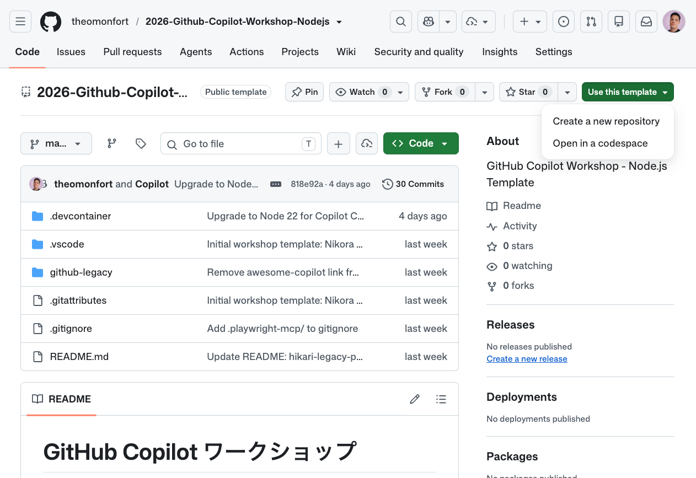
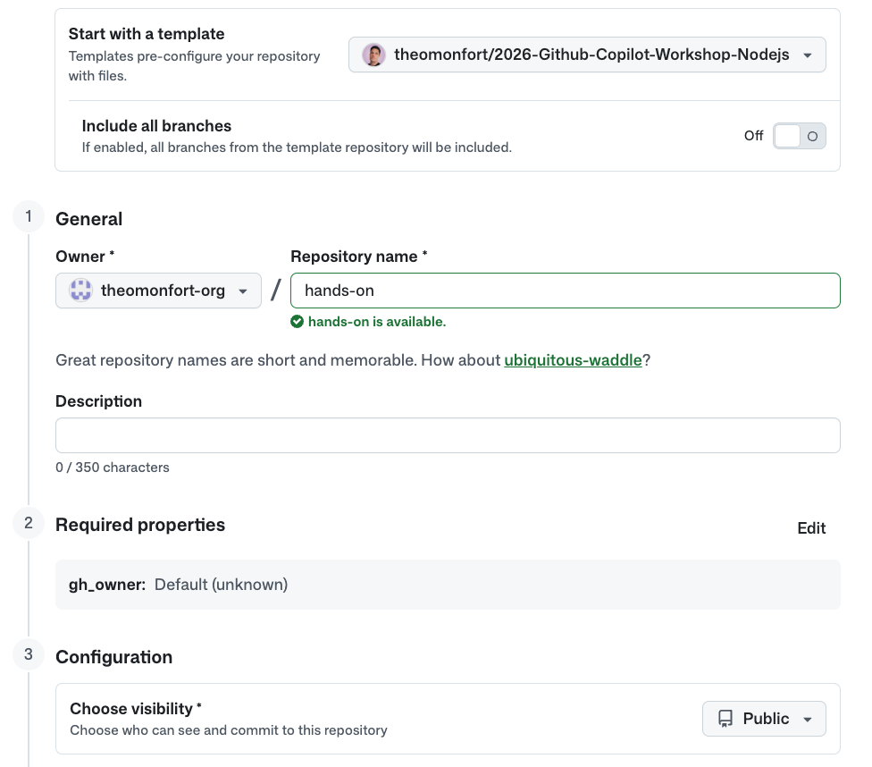
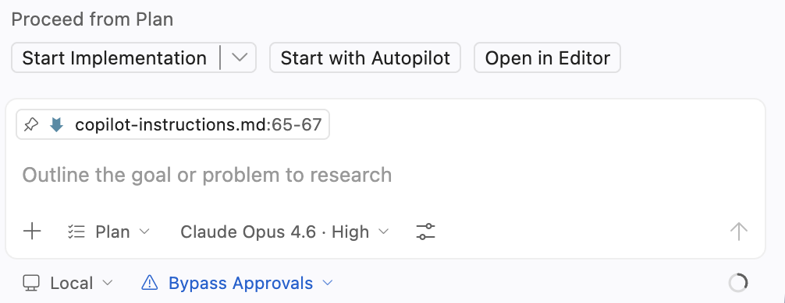
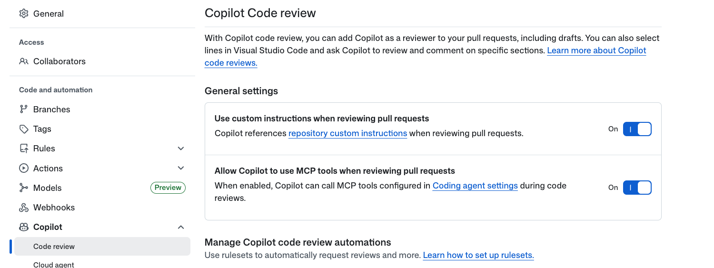
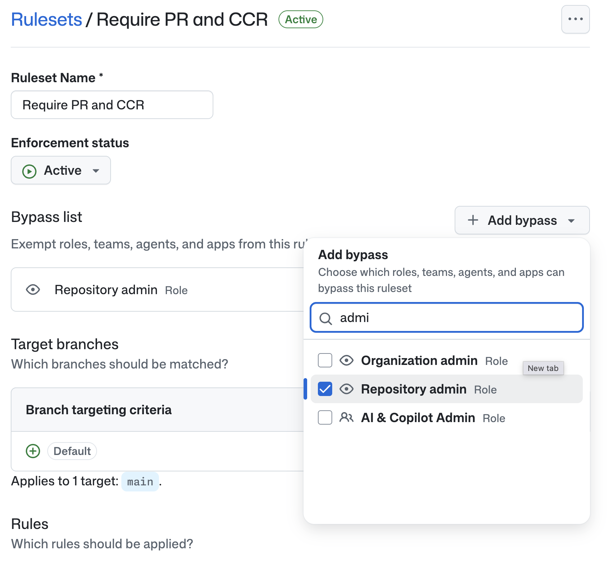
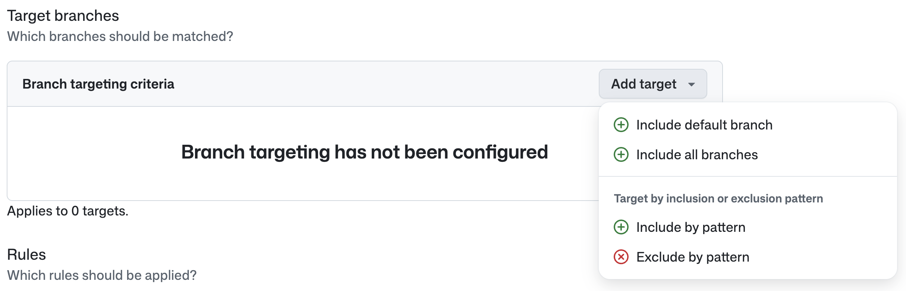
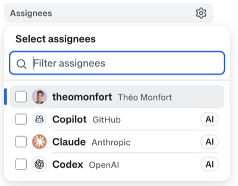
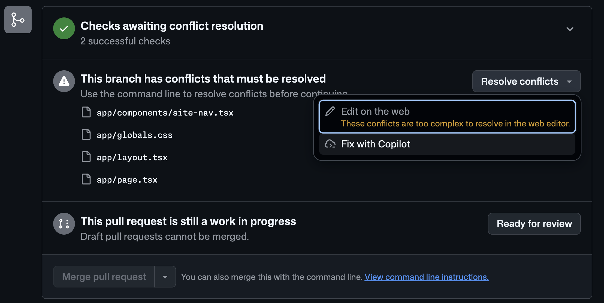
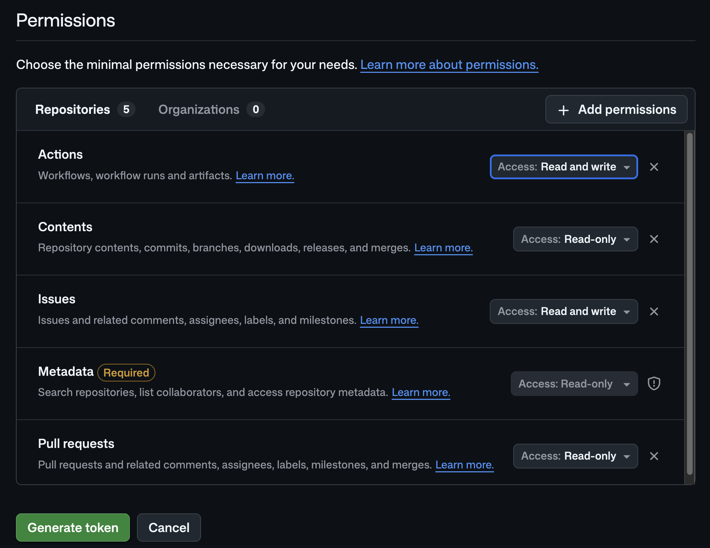
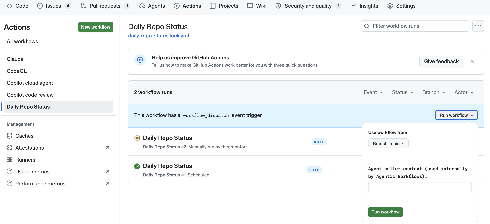

author: Theo Monfort
summary: GitHub Copilot ハンズオン勉強会
id: github-copilot-workshop
categories: AI, Development
environments: Web
status: Published
feedback link: https://example.com/feedback

# GitHub Copilot ハンズオン勉強会

## INTRO：勉強会について
Duration: 5

GitHub Copilotワークショップへようこそ！


この勉強会では、[**Copilot Playbook**](https://theomonfort.github.io/theomonfort/playbook/github/?present=1) で紹介されているシンプルな概念を実際に手を動かして体験します。

**PLAN → CODE → REVIEW → TEST & SECURE → OPERATE** のフェーズに沿って GitHub Copilot を使い、最終的には Playbook の簡易版（Markdown を綺麗に閲覧できるサイト）を Copilot と一緒に作り上げます。

### 本日のゴール
- **PLAN**: MCP・Instruction・Skill で Copilot に「文脈」「ルール」「型」を仕込む
- **CODE**: Copilot Chat（Plan / Agent）でサイトを設計・実装する
- **REVIEW**: Copilot Code Review で PR を自動レビューする
- **TEST & SECURE**: Dependabot・CodeQL（GHAS）と GitHub Actions（Playwright）で品質と安全性を担保する
- **OPERATE**: Cloud Agent・Copilot CLI・Agentic Workflow で日常運用に AI を組み込む

> aside positive
> **📖 リファレンス**: 各ステップに対応する [Copilot Playbook](https://theomonfort.github.io/theomonfort/playbook/) のページを併記しています。社内展開時の参考資料としても活用してください。

### 前提条件

以下の環境をご用意ください：

- 以下の機能が有効化されたプライベート Organization を持っていること：
  - GitHub Actions
  - GitHub Copilot（Pro+ / Business / Enterprise）
  - GitHub Advanced Security (GHAS)
- Organization 内でリポジトリを作成できる権限があること

## INTRO：セットアップ
Duration: 15

このワークショップでは、以下の GitHub リポジトリを使用します：

**プロジェクトURL**: https://github.com/theomonfort/Github-copilot-workshop

### ステップ1: テンプレートからリポジトリを作成する

1. プロジェクト URL をブラウザで開く
2. 右上の **Use this template** ボタンをクリックし、**Create a new repository** を選択



3. リポジトリ作成画面で以下を設定：

- Owner は **Copilot / Actions / GHAS / Codespaces などが有効化された Organization** を選択
- Visibility は **Public** を選択

#### Repository name（リポジトリ名）
- 任意の名前を入力してください（例: `hands-on-yourname`）

4. **Create repository** をクリック



### ステップ2: Codespaces で開発環境を起動する

1. 作成したリポジトリのページで、緑色の **Code** ボタンをクリック
2. **Codespaces** タブを選択
3. **Create codespace on main** をクリック

> aside positive
> **⏳ 注意**: Codespace の起動には数分かかる場合があります。DevContainer のビルドが完了するまでお待ちください。

DevContainer が自動的に Node.js 22 環境をセットアップし、以下が事前にインストールされます：
- GitHub Copilot & Copilot Chat 拡張機能
- GitHub CLI（`gh`）
- GitHub MCP Server（`.vscode/mcp.json`、自動検出有効化済み）
- Copilot CLI（`@github/copilot`）
- pnpm（パッケージマネージャ）
- gh-aw（Agentic Workflow CLI）
- Playwright（Chromium ブラウザ済み）

### ステップ3: 題材コンテンツを確認する

`src/content/playbook/` に Markdown ファイルが配置されています。これらが今日のサイトの題材です。

VS Code のエクスプローラで `src/content/playbook/` を開き、いくつかファイルを覗いてみてください。後ほど Copilot にこれらを「グリッド + 詳細 + プレゼンテーションモード」で閲覧できるサイトに仕立ててもらいます。

## PLAN: MCP サーバー
Duration: 10


> aside positive
> **📖 参考**: [プレイブック / MCP Server](https://theomonfort.github.io/theomonfort/playbook/mcp/) で MCP の仕組み・接続方式 (stdio / HTTP)・VS Code での設定方法を確認できます。

このステップでは、Copilot に外部ツールへのアクセスを与える **MCP（Model Context Protocol）Server** を確認・追加します。MCP を整えると、Copilot が Issue 作成・最新ドキュメント参照などを直接実行できるようになります。

### 3.1 — GitHub MCP Server を確認する

このリポジトリには既に GitHub MCP Server が `.vscode/mcp.json` に設定されています。Codespace 起動時に VS Code が自動的に接続を確認します。

`.vscode/mcp.json` を開いて、以下の設定があることを確認してください：

```json
{
  "servers": {
    "github-mcp-server": {
      "type": "http",
      "url": "https://api.githubcopilot.com/mcp/"
    }
  }
}
```

Copilot Chat の入力欄にある **🔧 ツールボタン**（モデル選択の右側）をクリックして、`github-mcp-server` のツール（Issues / PRs / code search など）が一覧に表示されていることを確認しましょう。

⏱ 約1分

> aside positive
> **ポイント**: GitHub MCP Server は GitHub 公式提供。`gh` コマンドを叩く感覚で、Copilot が Issues / PRs / Actions / Code search を直接操作できます。

### 3.2 — Context7 MCP Server を追加する

**Context7** は、ライブラリやフレームワークの **最新の公式ドキュメント** を Copilot に取り込める MCP Server です。Astro / Tailwind / TypeScript など、進化の速いフレームワークを使う本ワークショップでは欠かせません。

1. **Cmd+Shift+P** (Windows/Linux は **Ctrl+Shift+P**) でコマンドパレットを開く
2. **「MCP: Add Server…」** を入力して選択
3. トランスポートに **「HTTP」** を選択
4. URL に `https://mcp.context7.com/mcp` を貼り付け
5. 保存先に **「Workspace」** を選択

インストール後、`.vscode/mcp.json` に `context7` が追加されていることを確認してください：

```json
{
  "servers": {
    "github-mcp-server": { "type": "http", "url": "https://api.githubcopilot.com/mcp/" },
    "context7": {
      "type": "http",
      "url": "https://mcp.context7.com/mcp"
    }
  }
}
```

動作確認として、Copilot Chat で以下を試してみましょう：

```
Context7 を使って Astro の content collections の最新ドキュメントを要約してください。
```

⏱ 約2分

> aside positive
> **ポイント**: HTTP 版を直接追加する方法を使うと、`npx` でパッケージをダウンロードする必要がないため、起動が一瞬で完了します。Marketplace の **「Browse MCP Servers」** から入る場合は stdio (npx 経由) 版の `io.github.upstash/context7` が選ばれ、初回起動時にパッケージのダウンロードで時間がかかる、または途中で止まることがあります。HTTP 版ならこの待ち時間が発生しません。
> 以後「Astro の最新の API は？」「Tailwind v4 の新しい記法は？」と聞くだけで、Copilot が Context7 経由で公式ドキュメントを引っ張ってきます。学習データのカットオフを気にする必要がなくなります。

## PLAN: Instruction
Duration: 15


> aside positive
> **📖 参考**: [プレイブック / Instructions](https://theomonfort.github.io/theomonfort/playbook/instructions) で Instruction ファイルの役割・スコープ・使い分けを確認できます。

Instruction ファイルは、リポジトリやファイル単位で Copilot に **常駐ルール** を与える「指示書」です。チーム全員の Copilot が同じ規約に従うようになります。

このステップでは、2 種類の Instruction ファイルを作成します：

- **`.github/copilot-instructions.md`** — リポジトリ全体に常時適用 (言語・Stack・規約)
- **`.github/instructions/frontend.instructions.md`** — フロントエンド系ファイルにのみ適用される **Path Instruction**（デザイントークン）

### 4.1 — リポジトリ共通の Instruction を作成する

Copilot Chat で以下のプロンプトを貼り付けてください：

<details>
<summary>📋 プロンプトを表示 / コピー</summary>

```
.github/copilot-instructions.md を作成してください。本文はすべて日本語で書いてください。
内容は以下のとおりにしてください：

# Copilot Instructions

## 言語

- すべての応答・コメント・コミットメッセージ・PR 説明は **日本語** で書く。

## Stack

- **Astro** のみ。Next.js・React Router・SvelteKit は使わない。
- ページ・レイアウトは Astro コンポーネント (.astro) を使う。
- マークダウンコンテンツは Astro の **content collections** (src/content/) を使う。
- スタイルは Tailwind CSS。必要に応じてスコープ付き <style> ブロック。
- TypeScript をすべての場所で使う (.ts, .astro frontmatter)。

## 規約

- ページは src/pages/。
- 再利用 UI は src/components/。
- マークダウンは src/content/<collection>/*.md。スキーマは src/content.config.ts。
- パッケージマネージャは **pnpm**。
```

</details>

⏱ 約2分

> aside positive
> **ポイント**: 以後 Copilot の応答が日本語に切り替わります。Stack 制約も自動で守られるようになります。

### 4.2 — フロントエンド専用の Path Instruction を作成する

特定のファイルパターンにだけ適用される **Path Instruction** を作成します。VS Code は `applyTo` の glob にマッチするファイルを触るときだけ、このルールを Copilot に渡します。

Copilot Chat で以下のプロンプトを貼り付けてください：

<details>
<summary>📋 プロンプトを表示 / コピー</summary>

```
.github/instructions/frontend.instructions.md を作成してください。
本文はすべて日本語で書いてください。先頭の YAML frontmatter は以下のとおりにしてください：

---
applyTo: "**/*.{astro,css,tsx,jsx,ts,js,html}"
description: "フロントエンドのデザイントークン（レトロ JRPG テーマ）"
---

本文は以下を日本語で含めてください：

# フロントエンド設計ルール

スタイル・コンポーネント・レイアウトを触るときは、以下のトークンを必ず適用する。

## テーマ

レトロ JRPG / サイバーパンクのアーケード。暗い背景にネオンのアクセント、ピクセル系タイポグラフィ。

## カラー

| 役割              | Hex        | 用途                              |
| ----------------- | ---------- | --------------------------------- |
| 背景 (ベース)     | `#05060f`  | body / page                       |
| 背景 (パネル)     | `#0a0e27`  | カード・サイドバー                |
| ネオンマゼンタ    | `#ff2e88`  | プライマリアクセント・アクティブ  |
| ネオンシアン      | `#00f0ff`  | セカンダリ・ホバー・リンク        |
| アンバー          | `#ffb000`  | 警告・ハイライト                  |
| フォスファ緑      | `#9bbc0f`  | 成功・CRT 風テキスト              |
| テキスト (通常)   | `#e6f1ff`  | 暗い背景上の本文                  |
| テキスト (薄)     | `#7a8aa8`  | 補助テキスト                      |

## フォント

- 見出し / UI: **`'DotGothic16'`** (ピクセル)、fallback `monospace`。
- 本文 (日本語 + ラテン): **`'Noto Sans JP'`**、fallback `system-ui, sans-serif`。
- コード: `'JetBrains Mono', 'Menlo', monospace`。

Tailwind ユーティリティ: `font-pixel` (DotGothic16)、`font-body` (Noto Sans JP)。

## エフェクト

- 画面オーバーレイに控えめな CRT スキャンライン。
- ネオングロー: `text-shadow: 0 0 8px <color>` / `box-shadow: 0 0 12px <color>`。
- ボーダー: `1px dashed` または `2px solid` のネオンカラー。
- コントラストは高めに。淡いパステルグラデは禁止。

## してはいけないこと

- 明るい / 白の背景。
- 完全な丸 (pill) 形状。角丸は最大 4px まで。
- 灰色のソフトドロップシャドウ。グロー (neon glow) のみ使う。
```

</details>

⏱ 約2分

> aside positive
> **ポイント**: `.astro` や `.css` を編集するときだけこの design token が自動的に Copilot に渡されます。`/init` や docs 編集など関係ないタスクでは混ざらないので、ノイズが減ります。

## PLAN: Skills
Duration: 10


> aside positive
> **📖 参考**: [プレイブック / Agent Skills](https://theomonfort.github.io/theomonfort/playbook/agent-skills) で Skill の仕組み・召喚され方を確認できます。

**Agent Skill** は、Copilot に「特定のタスクのこなし方」を仕込む再利用可能な指示セットです。プロンプトに合致したときに自動で召喚され、毎回テンプレを説明し直す必要がなくなります。

このステップでは、Issue を整った形で書ける Skill を入れて、実際に Issue を 1 件作ってみます。

### 5.1 — github-issues Skill をインストール

[`theomonfort/skills`](https://github.com/theomonfort/skills) から **`github-issues`** Skill を入れます。このスキルは bug report / feature request / task など複数のテンプレを持ち、ラベル・優先度・依存関係まで含めた構造化された Issue を書けるようになります。

VS Code のターミナルで以下を実行してください：

```bash
gh skill install theomonfort/skills github-issues
```

実行すると CLI から **対象エージェント** と **インストール先（scope）** を選ぶよう聞かれます：

- **Agent**: `copilot` を選択（VS Code の GitHub Copilot Chat 用）
- **Scope**: `project`（プロジェクト = このリポジトリ専用にインストール）

> aside positive
> **💡 ヒント**: スキルの公開方法は標準化されており、**公開リポジトリ + `skills/<skill-name>/SKILL.md`** の構成にするだけで `gh skill install <owner>/<repo> <skill-name>` で誰でもインストールできます（仕様: [agentskills.io](https://agentskills.io/specification)）。`github/awesome-copilot` はコミュニティ版のコレクションですが、SAML SSO で守られた組織からインストールしようとすると認可ステップが必要になるため、本ワークショップではフォーク先の `theomonfort/skills` を使います。

インストールが完了すると `.agents/skills/github-issues/SKILL.md` が追加されます。中身を開いて Copilot がどんなときにこの Skill を呼ぶのか、どんなテンプレを持っているのかを確認してみてください。

⏱ 約1分

### 5.2 — MCP + Skill で Issue を作成する

GitHub MCP Server + `github-issues` Skill を組み合わせて、構造化された Issue を 1 件作成します。Copilot Chat で以下のプロンプトを入力してください：

<details>
<summary>📋 プロンプトを表示 / コピー</summary>

```
github-issues skill を使って、このリポジトリに以下の Issue を作成してください。
ユーザーストーリー・受け入れ基準・実装ノートを含む構造化された feature request にしてください。

タイトル: Add English support on the website

背景:
- 現在サイトはすべて日本語で書かれている。海外のエンジニアにも届けたい。

要件:
- Astro の i18n ルーティング (`/en/...`) で英語版を追加する。フォールバックは日本語。
- ナビゲーション・ボタン等の UI 文字列は src/i18n/ja.ts / en.ts に切り出す。
- src/content/ のマークダウンは ja / en の両言語を併設できる構造にする。
- 言語切替トグルをサイトのヘッダーに追加する。

受け入れ基準:
- /en/ ルートでサイト全体が英語で閲覧できる。
- 翻訳が無いページはフォールバックで日本語を表示し、上部に warning banner を出す。
- 既存の SEO (sitemap, OG tags) が両言語で正しく出力される。

ラベル: feature, i18n, frontend
```

</details>

⏱ 約2分

> aside positive
> **ポイント**: **MCP** が「ツールへの接続」を、**Skill** が「そのツールでの作法」を持ち込みます。本来 Copilot は SKILL.md の説明から自動でスキルを召喚しますが、確実に発動させるために今回はプロンプトで明示的に指定しています。テンプレに沿った Issue が GitHub に直接立てられるのを確認してください。
>
> このあと作成された Issue は、Cloud Agent や Agentic Workflow のステップで実装担当として割り当てます（次の章で）。


## CODE: Copilot Chat
Duration: 30

> aside positive
> **📖 参考**: [プレイブック / Copilot Chat](https://theomonfort.github.io/theomonfort/playbook/copilot-chat/) で Plan / Agent モードの違いと使い分けを確認できます。

ここまでで PLAN 側 (MCP・Instruction・Skill) のハーネスが整いました。いよいよ **Copilot Chat の Plan モード** で実装計画を立て、Agent モードで一気に実装します。

### 6.1 — Plan モードに切り替える

Copilot Chat のモード切替えから **「Plan」** を選択してください。

> aside positive
> **💡 ヒント**: Plan モードでは Copilot は **設計と質問** に徹し、すぐにファイルを書き換えません。要件が曖昧な部分は逆質問してきます。納得できる計画になるまで対話を重ねましょう。

### 6.2 — 実装計画を依頼する

以下のプロンプトをそのままコピーして Copilot Chat に貼り付けてください：

```
小さな Astro サイトを作ってください。

- グリッドのインデックスページ：src/content/playbook/*.md の各マークダウンエントリーを 1 タイル表示する（アイコン + タイトル + 短いサマリーを載せたクリック可能なカード）。
- タイルをクリック → そのエントリーの詳細ページが開き、マークダウン全文をスクロール可能に表示する。
- 詳細ページで「P」キーを押す → Presentation モードのトグル：
    * 各 ## 見出しが 1 スライドになる。
    * ← → でエントリー内のスライド間を移動。
    * ↑ ↓ で前後のエントリーへ移動。
    * Esc で Presentation モードを抜ける。
- Presentation モード時の左サイドバーは全エントリーの目次にし、現在表示中のエントリーをハイライトする。
```

Copilot がいくつか質問してくる場合があります（例：パッケージマネージャー、UI フレームワーク、デプロイ先など）。`copilot-instructions.md` を読んでいるはずなので Astro / Tailwind / pnpm を前提に答えてくれるはずですが、不足があれば回答してあげましょう。

⏱ 約3分

> aside positive
> **ポイント**: 4.1 で書いた Stack ルールと、4.2 のフロントエンド design token がここで効きます。Plan が Astro + Tailwind + 指定カラーで提案されるはずです。

### 6.3 — Autopilot で実装する

Plan に納得したら **「Start with Autopilot」** をクリックして実装を開始します。



⏱ 約15〜20分

Copilot が以下を自動で実行します：

- Astro プロジェクトの初期化（pnpm）
- `src/content.config.ts` で playbook collection を定義
- グリッドのインデックスページ
- 詳細ページ（dynamic route + content rendering）
- Presentation モードのキーボード操作（P / ← → / ↑ ↓ / Esc）
- 左サイドバー（目次 + 現在エントリーのハイライト）
- design token に沿った Tailwind スタイル

実装が完了したら開発サーバーを起動して確認しましょう：

```bash
pnpm dev
```

ポートフォワーディングの通知から **「ブラウザで開く」** をクリックして動作確認してください。

> aside positive
> **やってみよう**: 詳細ページで `P` を押し、Presentation モードに入って ← → ↑ ↓ Esc を試してみてください。挙動がおかしい箇所があれば、Copilot Chat にそのまま伝えれば直してくれます。

## REVIEW: Copilot Code Review
Duration: 15

> aside positive
> **📖 参考**: [プレイブック / Copilot Code Review](https://theomonfort.github.io/theomonfort/playbook/copilot-code-review/?present=1) で Code Review の自動化と Custom Instructions の効き方を確認できます。

実装が動いたら、PR を作る前に **Copilot Code Review** をハーネスに組み込みます。`copilot-instructions.md` のルール（言語・Stack・コードレビュー観点）が自動でレビューに反映されます。

### 7.1 — Copilot Code Review の設定を有効化する

まず、Copilot Code Review の設定を確認します。

1. リポジトリの **Settings** → **Copilot** → **Code review**
2. 以下を有効化：
   - **Use custom instructions when reviewing pull requests** → On
   - **Allow Copilot to use MCP tools when reviewing pull requests** → On



> aside positive
> **ポイント**: Custom instructions を有効にすると、`copilot-instructions.md` の内容がコードレビューにも反映されます。MCP tools を有効にすると、レビュー時に Context7 などの外部ツールも活用できます。

### 7.2 — Ruleset で自動レビューを設定する

PR 作成時に Copilot が自動的にコードレビューを行う設定をします。

1. リポジトリの **Settings** → **Rules** → **Rulesets** → **New ruleset** → **New branch ruleset**
2. Ruleset 名を入力（例: `Require PR and CCR`）
3. **Enforcement status** を **Active** に変更
4. **Bypass list** → **Add bypass** → **Repository admin** を追加
5. **Target branches** → **Add target** → **Include default branch** を選択
6. **Require a pull request before merging** を有効化
   - **Required approvals** を **1** に設定
7. **Automatically request Copilot code review** にチェック
8. **Create** をクリック



> aside positive
> **ポイント**: Bypass list に Repository admin を追加しておくと、急いでいる時にチェックを待たずにマージできます。



> aside negative
> **注意**: Enforcement status が「Disabled」のままだとルールが適用されません。必ず **Active** に変更してください。

### 7.3 — PR の結果を確認する

実装をコミット・push して PR を作成すると、Copilot Code Review が自動的に実行され、以下が表示されます（⏱ 約5分）：

- ✅ **Pull Request Overview** — PR 全体のサマリーコメント
- ✅ **コード提案** — 各ファイルに対する具体的な改善提案

### 7.4 — レビュー提案を修正する

Copilot のレビュー提案を修正する方法は2つあります：

1. **Commit suggestion** — 個別の提案を1つずつコミット
2. **Fix batch with Copilot** — すべての提案を一括で修正（おすすめ）

**Fix batch with Copilot** をクリックすると、修正内容を含む **新しい PR** が自動的に作成されます（⏱ 約15分）。

1. まず **修正用の新しい PR** をマージ
2. 次に **元の PR** をマージ

> aside negative
> **注意**: 場合によっては新しい PR が作成されず、修正が直接元の PR にコミットされることもあります。その場合はそのまま元の PR をマージしてください。

> aside positive
> **ポイント**:
> - Copilot Code Review のセッションは **Actions** タブで確認でき、レビュープロセスは完全に透明です。
> - レビューコメントが日本語で表示されているのは、`copilot-instructions.md` で設定した言語指定が反映されているためです！
> - `copilot-instructions.md` にレビュー観点（例: セキュリティ重視、パフォーマンス重視）を追記することで、レビュー内容をカスタマイズできます。

## TEST & SECURE: Dependabot & CodeQL（任意）
Duration: 5

> aside positive
> **📖 参考**: [プレイブック / GitHub Advanced Security](https://theomonfort.github.io/theomonfort/playbook/github-advanced-security/?present=1) で GHAS が提供する保護（Dependabot / CodeQL / Secret Scanning）の全体像を確認できます。

依存関係の脆弱性チェックとコードスキャンを **GHAS** で有効化します。設定は数クリックで完了します。

### 8.1 — Dependabot と CodeQL を有効化する

1. リポジトリの **Settings** → **Security** → **Advanced Security**
2. **Dependabot** セクション：
   - **Dependabot security updates** を有効化
   - **Dependabot version updates** を有効化
3. （オプション）**Tools** → **CodeQL analysis** → **Set up** → **Default** → **Enable CodeQL**


> aside negative
> **注意**: CodeQL はデフォルトブランチに存在する言語のみスキャンします。最初の Astro PR をマージしてから CodeQL を有効化すると、以降の Push / PR で TypeScript / JavaScript の自動スキャンが実行されます。

> aside positive
> **ポイント**: Dependabot は週次で依存関係をチェックし、脆弱性が見つかれば自動的に PR を作成してくれます。CodeQL は静的解析でセキュリティ上の問題（XSS / SQL Injection 等）を検出します。

## TEST & SECURE: Actions（任意）
Duration: 15

> aside positive
> **📖 参考**: [プレイブック / GitHub Actions](https://theomonfort.github.io/theomonfort/playbook/github-actions/?present=1) で Actions のワークフロー構造とトリガーの仕組みを確認できます。

Presentation モードの **キーボードナビゲーション** が壊れないように、Playwright で E2E テストを書き、PR ごとに自動実行する Actions ワークフローを作ります。

### 9.1 — Presentation モードのテストを作成する

Copilot Chat（Agent モード）で以下を入力してください：

```
Presentation モードのキーボードナビゲーションを検証する Playwright E2E テストを作成してください。

前提：
- src/content/playbook/ に少なくとも 2 件のエントリーがあるとする。
- 詳細ページの URL パターンは `/playbook/[slug]`。

テストケース：
1. 詳細ページで `P` を押すと Presentation モードに入る（DOM の状態クラスやサイドバー表示で確認）。
2. Presentation モード中に `←` / `→` を押すとエントリー内のスライドが前後に移動する（## 見出しごとに 1 スライド）。
3. Presentation モード中に `↓` / `↑` を押すと次 / 前のエントリーに移動する（URL が変わる）。
4. Presentation モード中に `Esc` を押すと通常の詳細ページに戻る。
5. 左サイドバーに全エントリーが目次として表示され、現在のエントリーがハイライトされている。

ファイル配置:
- テストは tests/e2e/presentation.spec.ts に配置。
- 必要なら playwright.config.ts も更新してください（baseURL、webServer に pnpm dev を起動する設定）。

テストを書き終えたらローカルで `pnpm exec playwright test` を実行して全部 pass することを確認してください。
```

⏱ 約5分

### 9.2 — PR で自動実行する Actions ワークフローを作成する

続けて Copilot Chat に以下を入力してください：

```
.github/workflows/test.yml を作成してください。
PR の作成・更新時にトリガーし、以下を実行してください：

1. Node.js 22 をセットアップ
2. pnpm をセットアップ
3. 依存関係をインストール
4. Playwright のブラウザをインストール（npx playwright install --with-deps chromium）
5. `pnpm exec playwright test` を実行
6. テスト失敗時は Playwright のレポートを artifact としてアップロード
```

⏱ 約2分

PR を作成し直すと、Actions タブで `test.yml` の実行が確認できます。Presentation モードの挙動を変更したときにこの workflow が早期に壊れを検知してくれます。

> aside positive
> **ポイント**: テストを書き、Actions で常時実行しておくことで、Cloud Agent や次の Agentic Workflow が自動的に PR を作るようになっても、レグレッションを検知できる安全網が手に入ります。


## CODE: Cloud Agent
Duration: 20

> aside positive
> **📖 参考**: [プレイブック / Cloud Agent](https://theomonfort.github.io/theomonfort/playbook/cloud-agent/?present=1) で Cloud Agent の動作・Issue アサインの仕組み・PR 連携を確認できます。

### 5.1 — Copilot の設定を確認する

Cloud Agent を使用するために、以下の設定を確認します：

1. GitHubの右上のプロフィールアイコン → **Copilot settings**
2. **Copilot Cloud Agent** が有効になっていることを確認

### 5.2 — 既存の Issue に Cloud Agent をアサインする

Step 1.4 で作成した Issue の中から、Cloud Agent に実装させたい Issue を開きます。

1. Issue を開く
2. 右サイドバーの **Assignees** をクリック
3. **Copilot**（GitHub）、**Claude**（Anthropic）、**Codex**（OpenAI）から選択してアサイン



アサイン時に以下をカスタマイズできます：

- **追加プロンプト** — Issue の説明に補足指示を追加
- **モデル選択** — Copilot / Claude / Codex から選択
- **ベースブランチ** — 作業の起点となるブランチを指定

> aside positive
> **ポイント**: Cloud Agent が自律的にコードを実装し、PR を作成します（⏱ 各 Issue につき約15分）。Step 4.1 で設定した Validation Tools（CodeQL、Code Review、Secret Scanning）が有効な場合、Agent は自分の実装を検証してから PR を提出します。複数の Issue を同時にアサインすると並行して処理されます。

### 5.3 — PR を確認してマージする

Cloud Agent が作成した PR は **Draft（下書き）** 状態で作成されます。

1. PR を開き、内容を確認
2. **Ready for review** をクリックして Draft を解除
3. Copilot Code Review が自動的に開始されます
4. レビュー完了後、PR をマージ

> aside negative
> **コンフリクトが発生した場合**: 複数の Cloud Agent が並行して作業すると、同じファイルを変更してコンフリクトが発生することがあります。**Resolve conflicts** → **Fix with Copilot** をクリックすると、Copilot が自動的にコンフリクトを解決してくれます。



### 5.4 — 最新コードを取得して確認する

Cloud Agent の PR がマージされたら、Codespace で最新のコードを取得してサイトを確認しましょう。

```bash
git checkout main && git pull && npm install && npm run dev
```

ポートフォワーディングの通知が表示されたら **「ブラウザで開く」** をクリックして、Cloud Agent が実装した新機能を確認してください。

## CODE: CLI
Duration: 45

> aside positive
> **📖 参考**: [プレイブック / Copilot CLI](https://theomonfort.github.io/theomonfort/playbook/cli/) で Copilot CLI の Plan ↔ Agent 切替えとターミナル中心のワークフローを確認できます。

**Copilot CLI** は、ターミナル上で動作する対話型 AI アシスタントです。VS Code を開かずに、コード生成・レビュー・リファクタリングなどを自律的に実行できます。

### 主なコマンド

| コマンド | 説明 |
|---|---|
| `/model` | AIモデルの選択（Claude、GPT 等） |
| `/mode` | モード切り替え（plan、agent 等） |
| `/init` | リポジトリをスキャンし copilot-instructions.md を生成 |
| `/review` | コードレビューを実行 |
| `/fleet` | 複数エージェントの並列実行 |
| `/chronicle` | セッション履歴の確認 |
| `/skill` | スキルの管理・実行 |
| `/resume` | 前回のセッションを再開 |

### 7.1 — Copilot CLI を起動する

VS Code のターミナルで Copilot CLI を起動します：

```bash
copilot
```

> aside negative
> **Codespaces の場合**: 初回実行時に「Install GitHub Copilot CLI?」と表示されたら `y` を入力してインストールしてください。

### 7.2 — AI 利用状況ダッシュボードを構築する

Copilot CLI を使って、組織内の AI 利用状況を可視化するウェブサイトを構築します。

#### 準備

```
/allow-all
```

```
/model
```

最も高性能なモデル（例: Claude Opus 4.6）を選択してください。

#### 実装

**Shift+Tab** で Autopilot モードに切り替えた後、以下のプロンプトを実行：

```
/fleet 組織内の GitHub Copilot 利用状況を可視化するダッシュボード Web アプリケーションを ai-usage-dashboard/ ディレクトリに構築してください。

要件:
- フレームワーク: Next.js + TypeScript + Tailwind CSS
- GitHub Copilot Metrics API を使用してデータを取得
  - エンドポイント: GET /orgs/{org}/copilot/metrics
  - 認証: Bearer Token（環境変数 GITHUB_TOKEN から取得）
- ダッシュボード機能:
  - アクティブユーザー数の推移グラフ
  - 言語別のコード提案受入率
  - 日別・週別の利用統計
  - チャット vs コード補完の利用比率
- チャート: Recharts を使用
- レスポンシブデザイン
- ダークモード対応
- 動作確認まで行ってください
```

### 7.3 — 複数モデルでコードレビュー

作成したダッシュボードのコードを複数モデルでレビューします：

```
/review Claude Opus 4.6 と GPT-5.4 の各モデルで ai-usage-dashboard/ のコードをレビューし、結果を比較して表示してください
```

### 7.4 — Chronicle で利用状況を分析する

最後に、Copilot CLI の experimental モードを使って、自分の AI 利用状況を分析してみましょう。

```
/experimental
```

Chronicle コマンドを使用して、ワークショップ中の Copilot 利用状況のアドバイスを取得します：

```
chronicle
```

> aside positive
> **Chronicle のポイント**: Chronicle は Copilot の利用パターンを分析し、より効果的な使い方のアドバイスを提供します。個人の利用傾向に合わせた改善提案を受けることができます。

## OPERATE: Agentic Workflow
Duration: 15

> aside positive
> **📖 参考**: [プレイブック / Agentic Workflow](https://theomonfort.github.io/theomonfort/playbook/agentic-workflow) で Agentic Workflow の概念と GitHub Actions × Copilot の連携パターンを確認できます。

GitHub Actions と Copilot（AI）を組み合わせることで、コードの変更を検知して自律的なタスクを自動実行する **Agentic Workflow** を体験しましょう。

**Agentic Workflow とは**: GitHub Actions のワークフロー内で Copilot を活用し、リポジトリの変更に応じた自律的なタスク（レポート生成、ドキュメント更新、コード修正など）を実行する仕組みです。

#### gh aw のインストール

まず、Agentic Workflow の CLI ツールをインストールします。

ローカル環境の場合：
```bash
gh extension install github/gh-aw
```

Codespaces やネットワーク制限がある環境の場合（GA 前のため）：
```bash
curl -sL https://raw.githubusercontent.com/github/gh-aw/main/install-gh-aw.sh | bash
```

### 6.1 — Personal Access Token (PAT) を作成する

Agentic Workflow で Copilot を活用するために PAT を作成します。

1. [https://github.com/settings/personal-access-tokens/new](https://github.com/settings/personal-access-tokens/new) にアクセス
2. 設定内容：
   - **Token name**: `copilot-workshop-agent`
   - **Resource owner**: リポジトリを作成した Organization（または個人アカウント）
   - **Repository access**: Only select repositories → 作成したリポジトリを選択
   - **Permissions**:
     - **Actions**: Read and write
     - **Contents**: Read-only
     - **Issues**: Read and write
     - **Metadata**: Read-only（自動付与）
     - **Pull requests**: Read and write


3. 作成した PAT をコピー

> aside negative
> **注意**: PAT は作成時に一度だけ表示されます。必ずコピーして安全な場所に保存してください。再表示はできません。

#### リポジトリシークレットに設定

1. リポジトリの **Settings** → **Secrets and variables** → **Actions**
2. **New repository secret** をクリック
3. Name: `COPILOT_GITHUB_TOKEN`、Value: 作成した PAT

#### Workflow permissions の確認

1. **Settings** → **Actions** → **General**
2. **Allow GitHub Actions to create and approve pull requests** にチェック

### 6.2 — Daily Repo Status ワークフローを作成する

今日のリポジトリ活動を自動レポートする Agentic Workflow を作成しましょう。

エージェントモードで以下を実行：

```
以下の Agentic Workflow を作成してください。

ファイル: .github/workflows/daily-repo-status.md

目的: リポジトリの活動（Issue、PR、コード変更）を分析し、
日次ステータスレポートを Issue として自動作成する。

フォーマット:
- YAML front matter で設定を定義（on, permissions, tools, safe-outputs）
- Markdown 本文でワークフローの指示を記述

設定:
- トリガー: schedule: daily と workflow_dispatch
- permissions: contents: read, issues: read, pull-requests: read
- tools: github（lockdown: false, min-integrity: none）
- safe-outputs: create-issue で title-prefix "[repo-status] "、
  labels: [report, daily-status]、close-older-issues: true

ワークフローの指示:
1. リポジトリの最近の活動（Issue、PR、コード変更）を収集
2. 進捗やハイライトを分析
3. 結果を GitHub Issue として作成

参考: https://github.com/githubnext/agentics/blob/main/workflows/daily-repo-status.md

完了したら `gh aw compile` コマンドを実行してワークフローをコンパイルし、
変更をコミットして PR を作成してください。
```

> aside positive
> **ポイント**: `gh aw compile` は `.md` ファイルから GitHub Actions が実行できる `.lock.yml` ファイルを生成します。コンパイルしないとワークフローは動作しません。

PR をマージした後、**Actions** タブからワークフローを手動実行します：

1. リポジトリの **Actions** タブを開く
2. 左メニューから **Daily Repo Status** を選択
3. **Run workflow** → **Run workflow** をクリック



実行完了後（⏱ 約2分）、リポジトリの **Issues** タブに `[repo-status]` というプレフィックスの Issue が自動作成され、今日の PR、Issue、コード変更の活動サマリーが表示されます。

> aside positive
> **ポイント**: Agentic Workflow は通常の GitHub Actions とは異なり、`gh aw run` コマンドで実行します。スケジュール実行（毎日自動）も設定可能です。

### 6.3 —（ボーナス）テストカバレッジ自動更新ワークフローを作成する

余裕がある方は、テストカバレッジレポートを自動更新するワークフローも作成してみましょう。

エージェントモードで以下を実行：

```
以下の Agentic Workflow を作成してください。
参照: https://github.com/github/gh-aw/blob/main/create.md

ワークフローの目的：
- main ブランチへの push 時にトリガー
- テストを実行してカバレッジレポートを生成
- カバレッジ結果を README.md のバッジとして自動更新
- 変更がある場合は PR を自動作成

ワークフローファイルは .github/workflows/coverage-update.md に配置してください。
```

## おめでとうございます 🎉
Duration: 5

### 今日学んだこと

このワークショップでは、GitHub Copilot を **PLAN → CODE → REVIEW → TEST & SECURE → OPERATE** のフェーズに沿って横断的に体験しました：

- **PLAN：MCP サーバー** — GitHub MCP・Context7 で Copilot に最新コンテキストを与える
- **PLAN：Instruction** — `copilot-instructions.md` と Path Instruction で Copilot の前提・スタイル・言語を固定する
- **PLAN：Skills** — awesome-copilot の Skill を導入し、Issue 作成を自動化する
- **CODE：Copilot Chat** — Plan モードで設計し、Agent モードでサイトを実装する
- **REVIEW：Copilot Code Review** — PR の自動レビューで品質を担保する
- **TEST & SECURE：Dependabot & CodeQL** — 依存関係とコードの脆弱性を継続的に検出する
- **TEST & SECURE：Actions** — GitHub Actions で Playwright テストを自動化する
- **CODE：Cloud Agent** — Issue を Copilot にアサインしてバックグラウンドで実装させる
- **CODE：CLI** — ターミナルから Copilot CLI で Plan ↔ Agent を行き来する
- **OPERATE：Agentic Workflow** — `gh-aw` で AI を組み込んだ自律的な CI/CD を構築する

### 次のステップ

- [プレイブック](https://theomonfort.github.io/theomonfort/playbook/) を社内資料として参照・展開する
- 実際のプロジェクトで Copilot を `/init` → Plan → Agent の順で活用してみる
- Cloud Agent と Agentic Workflow で日常的なタスクを自動化する
- Copilot CLI を日々のターミナル作業に組み込む

### リソース

- [Theo's Copilot Playbook](https://theomonfort.github.io/theomonfort/playbook/)
- [GitHub Copilot Documentation](https://docs.github.com/copilot)
- [GitHub Copilot ベストプラクティス](https://docs.github.com/copilot/using-github-copilot/best-practices-for-using-github-copilot)
- [awesome-copilot](https://github.com/github/awesome-copilot)
- [gh-aw (Agentic Workflows)](https://github.com/githubnext/gh-aw)
- [Copilot CLI](https://github.com/github/copilot-cli)
