author: Your Name
summary: Nikon GitHub Copilot ワークショップ
id: github-copilot-workshop
categories: AI, Development
environments: Web
status: Published
feedback link: https://example.com/feedback

# Nikon GitHub Copilot ワークショップ

## ワークショップについて
Duration: 5

GitHub Copilotワークショップへようこそ！このワークショップでは、GitHub Copilot を使ってコードの解説や改善を行う方法を学びます。
GitHub Copilot Chat は Chat 体験を通じて AI との対話を行うことができます。 ぜひ、このワークショップを通じて GitHub Copilot の使い方を学んでみましょう。


### 本日のゴール
- GitHub Copilotの各種機能を理解する
- エージェントモードを使って、新規にアプリケーションを開発する

### 前提条件
- Visual Studio Code がインストールされていること
- GitHub Copilotのライセンスがあること
- GitHubアカウントを持っていること

## プロジェクトのセットアップ
Duration: 15

このワークショップでは、以下のGitHubリポジトリを使用します：

**プロジェクトURL**: https://github.com/moulongzhang/2026-Github-Copilot-Workshop-Python

### ステップ1: テンプレートからリポジトリを作成する

まず、上記のプロジェクトURLをブラウザで開き、テンプレートから自分のリポジトリを作成します：

1. プロジェクトURL（https://github.com/moulongzhang/2026-Github-Copilot-Workshop-Python）をブラウザで開く
2. 右上の **Use this template** ボタンをクリックし、**Create a new repository** を選択

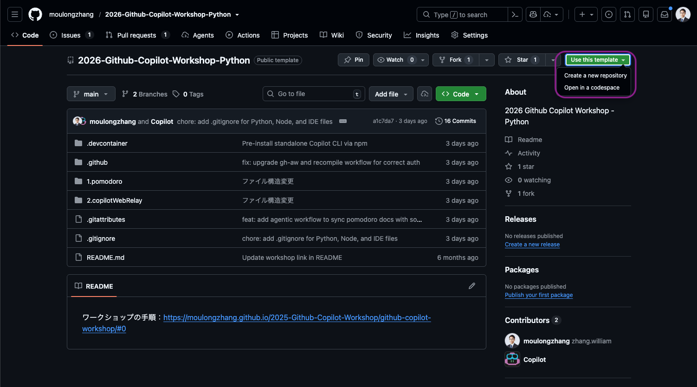

3. リポジトリ作成画面で、リポジトリ名を入力し **Create repository** ボタンをクリック

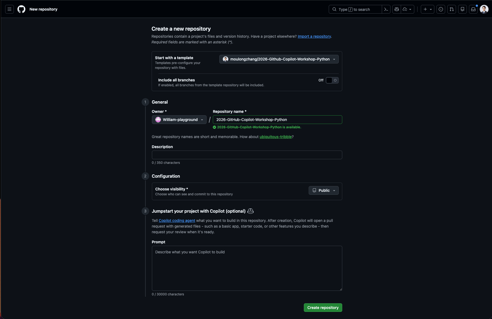

> aside negative
> **⚠️ 重要**: リポジトリ作成時に **Visibility（公開設定）は必ず「Public」** を選択してください。Private リポジトリでは、一部の Copilot 機能や GitHub Actions が正しく動作しない場合があります。

テンプレートからの作成が完了すると、あなたのGitHubアカウントに新しいリポジトリが作成されます。

### ステップ2: 開発環境のセットアップ

作成したリポジトリを使って、GitHub Codespacesで開発環境を準備します：

1. 作成したリポジトリのページで（`https://github.com/[あなたのユーザー名]/2026-Github-Copilot-Workshop-Python`）
2. 緑色の **Code** ボタンをクリック
3. **Codespaces** タブを選択
4. **Create codespace on main** をクリック


## ポモドーロタイマーを作ってみよう
Duration: 30

ここまでで、VS Code上で利用できるGitHub Copilotの基本的な使い方を学びました。次は、実際にアプリケーションを開発してみましょう。

今回のハンズオンでは、ポモドーロタイマーアプリケーションを開発します。このアプリケーションは、作業時間と休憩時間を設定し、タイマーを管理する機能を持っています。

以下のようなUIを持つアプリケーションを作成することを目指します。


では、まずVS Code上で、新しいPythonファイルを作成しましょう。今回はWebアプリケーションとして作成したいので、Flaskを使用します。メインファイル名は「app.py」としましょう。

### プロジェクトの概要

ポモドーロテクニック用のWebタイマーアプリケーションを作成します。

### 必要な機能

- 25分の作業タイマー
- 5分の休憩タイマー
- タイマーの開始・停止・リセット
- 進捗表示と統計機能
- ブラウザ通知とサウンド通知
- レスポンシブなWebUI

> aside positive
> **ポモドーロタイマーとは？**: ポモドーロ・テクニックは、1980年代にフランチェスコ・シリロによって考案された時間管理術です。「25分の作業 + 5分の休憩」を1セット（＝1ポモドーロ）とし、これを繰り返すことで集中力を維持しながら効率的に作業を進める手法です。詳しくは [Wikipedia: ポモドーロ・テクニック](https://ja.wikipedia.org/wiki/%E3%83%9D%E3%83%A2%E3%83%89%E3%83%BC%E3%83%AD%E3%83%BB%E3%83%86%E3%82%AF%E3%83%8B%E3%83%83%E3%82%AF) をご覧ください。

## ポモドーロタイマーの設計を考える
Duration: 10

まず、いきなり実装を始めるのではなく、どういった方針・設計で進めるかをCopilotに相談してみましょう。ここから先は、すべてエージェントモードで進めていきます。

### エージェントモードへの切り替え

Copilot Chatのモード選択から「エージェント」を選択します。エージェントは、ユーザーの意図を理解し、より自律的にタスクを実行することができます。

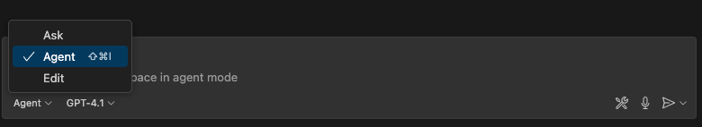


### 設計の相談

今回のようにUIを持ったWebアプリケーションを作成するにあたって役に立つのが、Copilot Chatに画像をアップロードする機能です。これを使うことで、アプリケーションのUIイメージをCopilotに理解させることができます。

前ページのUIイメージをまずはプロジェクトのルートに `pomodoro.png` として保存してください。その後、チャット欄の `Add Context` をクリックし、「Image from Clipboard」または「Files & Folders...」を選択します。そして、UIイメージの画像を選択します。

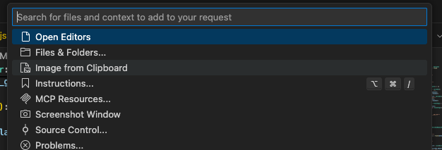

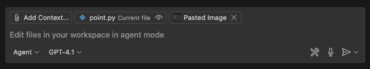

画像のアップロードができたら、Copilot Chatに画像が表示されます。

その上で、次のプロンプトを入力してみましょう。

```
このプロジェクトでポモドーロタイマーのWebアプリを作成する予定です。添付の画像はそのアプリのUIモックです。FlaskとHTML/CSS/JavaScriptを使用してこのアプリを作成するにあたって、どのような設計で進めるべきか、アーキテクチャの提案をしてください。
```

すると、推奨のWebアプリケーションアーキテクチャを提案してくれます。

このアーキテクチャに対して、もっとこうした方が良いという点や考慮不足の点があれば、それを指摘してみましょう。例えば次のような指摘です。

```
ユニットテストのしやすさという点を考慮して、今のアーキテクチャにもし改善や追加が必要な点があればそれも書き出してください。
```

このやり取りを経て、アーキテクチャの設計が固まったら、一度その内容をファイルに保存してもらいましょう。そうすることで、別のチャットセッションを開いても、同じアーキテクチャの内容を参照することができます。

```
ここまでの会話でアーキテクチャについては固まったので、これまでの会話の内容を踏まえて、プロジェクトのルートにarchitecture.mdというファイルに、Webアプリケーションアーキテクチャ案をまとめてください。
```

> aside positive
> Copilot Chatでのやりとりに一区切りがついたら、新しい会話を始めることで、よりCopilotに対して明確な指示を与えることができます。新しい会話を始めるには、チャットウィンドウの上部にある「新しい会話」ボタンをクリックします。その際、今回のアーキテクチャの内容のように、今後のチャットでも参照したい内容は、今回のようにファイルに書き出して保存しておくと便利です。

## やることを洗い出そう
Duration: 10

ここまでで、UIモックとアーキテクチャの設計が固まりました。具体的にどのような機能を実装する必要があるかを検討していきましょう。これもCopilot Chatに相談してみます。その際、pomodoro.pngとarchitecture.mdを添付しましょう。

```
このポモドーロタイマーアプリケーションを作成するにあたって、実装する必要のある機能を洗い出してください。
```


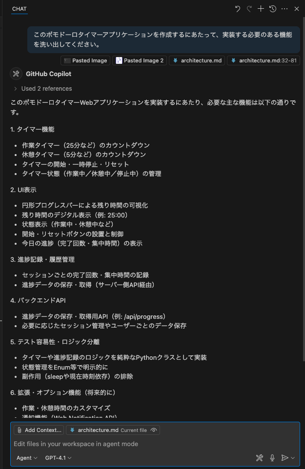

この内容もCopilotとのチャットを通して、改善していきましょう。内容が固まったら、アーキテクチャの時と同様にこの内容もfeatures.mdというファイルにまとめて保存しておきましょう。

```
ありがとうございます。その内容で良さそうなので、実装する必要のある機能一覧をfeatures.mdというファイルに書いてください。
```

では、ここから実装を始めるわけですが、Copilotを使いこなすコツとしては、一度に大きな機能を実装しようとするのではなく、まずは小さな機能から実装していくことです。これにより、Copilotが提案するコードの精度が上がり、よりスムーズに開発を進めることができます。

今回のアプリケーション開発を、どのような粒度で細分化して実装していくかについても、Copilotに相談してみましょう。ここでは、pomodoro.png、architecture.md、features.mdを添付しましょう。

```
このポモドーロタイマーアプリケーションを段階的に実装していきたいと考えています。添付の画像とアーキテクチャ、機能一覧を踏まえて、どのような粒度で機能を実装していくべきか、段階的な実装計画を提案してください。
```

私が試したところ、6つのステップからなる計画を提案してくれました。この点についても、もっとこうしてほしいなどがあれば、Copilotに指摘してみましょう。そして、この内容も後で参照できるように、plan.mdというファイルにまとめて保存しておきましょう。その際、どういうプロンプトで指示するべきかは、みなさん自身で考えてみてください。

## 実装しよう
Duration: 30

ここまでの準備が整ったので、いよいよ実装に取り掛かりましょう。前のステップで提案された実装計画に従って、段階的に機能を実装していきます。

### 1. ブランチの準備

実装を始める前に、作業用のブランチを作成しましょう。

#### ステップ1: ステージングされた変更をリセット

現在ステージングエリアにある変更を全てワーキングディレクトリに戻します：

```bash
git restore .
```

#### ステップ2: 新しいブランチを作成

feature/pomodoroブランチを作成して切り替えます：

```bash
git checkout -b feature/pomodoro
```

### 2. プロジェクト構成の準備

まずは、今回のアーキテクチャに従ったプロジェクトのディレクトリ構成を作成しましょう。

まずは、`architecture.md` のようなアーキテクチャを実現するにあたって、現在のプロジェクトのフォルダ構成を修正してください。必要に応じてファイルの移動や、設定ファイルの変更も行ってください。

その後、`pomodoro.png`, `architecture.md`, `plan.md` を添付した上で、次のようにCopilotに指示を出してみましょう。

```
plan.mdのステップ１を実装してください。その際、すでにこのプロジェクトにあるファイルを別のディレクトリに移動する必要があれば、その作業も実行してください。もし追加で考慮が必要なことがあれば、私に質問してください。
```

すると、私のケースでは以下のように検討が必要な質問をしてきました。こういった場合には、必要な情報を提供しましょう。


その後、Copilotは、ステップ1の実装を行います。実装が完了したら、Copilotは自らの判断でプロジェクトのビルドを行い、エラーがないかを確認します。エラーが発生した場合は、そのエラーを解決するために追加で修正を行います。このような自律的な動作が、エージェントモードの特徴です。

実装が完了したら、以下の点を確認してみましょう：

1. **ディレクトリ構造**：推奨されたアーキテクチャに沿った構成になっているか
2. **基本ファイル**：必要な基本ファイル（app.py、HTML テンプレート、CSS ファイルなど）が作成されているか
3. **動作確認**：簡単な動作テストを行って、エラーが発生していないか

以下が、私の場合のステップ1の実装結果です。この段階でどのようなアプリケーションになっているかは人によって異なるでしょう。

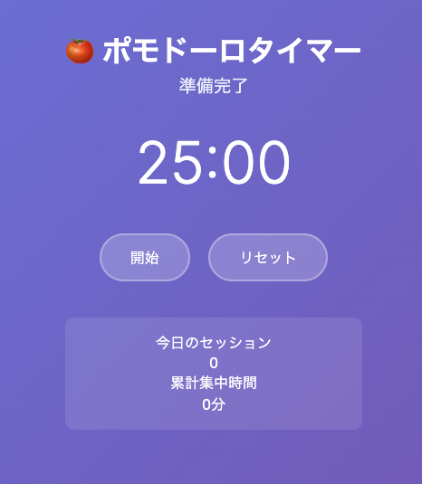

## テストを書こう
Duration: 20

このまま実装を続ける前に、実装した機能に対してユニットテストを書いておきましょう。ユニットテストを書くことで、後のステップでの変更が既存の機能に影響を与えないことを確認できます。

もし前ページの段階でユニットテストも実装されている場合は、このページは読み飛ばしてください。

### テストの実装

次のようなプロンプトを実行してみましょう。

```
現在の実装に対して、ユニットテストが全くないので、ユニットテストを実装してください。
```

すると、Copilotエージェントはユニットテスト用の依存関係をインストールするために、コマンドを使って良いかどうかを尋ねてきます。このように、エージェントが何かのコマンドを実行する前には、必ずユーザーに確認を求めます。ここでは、必要なコマンドを実行することを許可するために、「Continue」をクリックします。


すると、CopilotはVS Code内のターミナル内で、先ほどのコマンドを実行し、必要な依存関係をインストールします。それ以降も同様に、Copilotが何かのコマンドを実行する前には、必ずユーザーに確認を求めます。もし、そのコマンドを実行してエラーが発生した場合は、そのエラーを解決するために、エージェントは追加の修正を行います。

## 次のタスクに向けた設定
Duration: 20

ここから先のステップでは、GitHub.com上でのCopilot機能やCloud Agentを使用します。そのために必要な設定を行いましょう。

### 1. GitHub Advanced Security (GHAS) の設定

GitHub Advanced Security の Code Scanning 機能を有効にすることで、コードの脆弱性を自動的に検出できます。

1. 自分のリポジトリの **Settings** タブをクリック
2. 左サイドバーから **Security** → **Code security** を選択
3. **Code scanning** セクションで **Set up** をクリック


4. **Default** を選択（推奨）

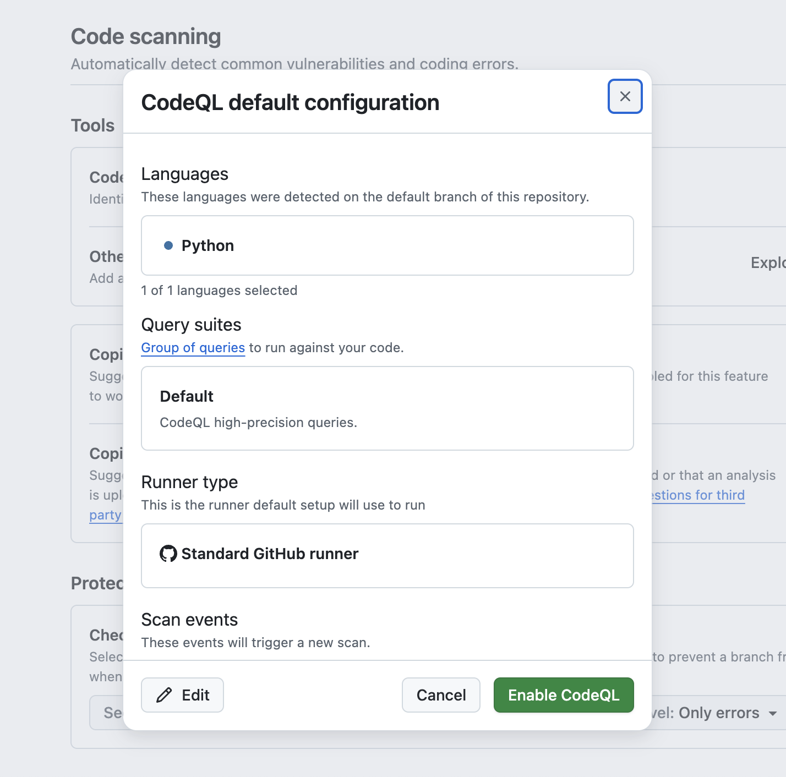

5. **Enable CodeQL** をクリック

これにより、プッシュ時やプルリクエスト作成時にコードの自動スキャンが実行されます。

### 2. Copilot 機能の有効化

GitHubで利用可能なCopilot機能を有効化しましょう。

1. GitHubの右上のプロフィールアイコンをクリック
2. **Copilot settings** を選択

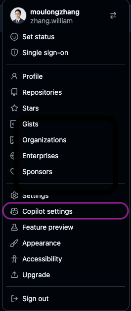

以下の機能を有効化してください：

- **Editor preview features** - エディタのプレビュー機能
- **Copilot CLI** - ターミナルでのCopilot利用
- **Copilot code review** - コードレビュー機能
- **Copilot Cloud Agent** - 自律的なコーディングエージェント

> aside negative
>
> **プラン制限**: Copilot Code Review、Cloud Agent、Copilot CLIなどの高度な機能は、GitHub Copilot Business/Enterprise プランでのみ利用可能です。Freeプランをご利用の場合、これらの機能は利用できません。

### 3. リポジトリの Issues と Actions を有効化

> **⚠️ この手順は、Issues や Actions が無効になっているユーザーのみ対象です。** すでに有効になっている場合はスキップしてください。

テンプレートから作成したリポジトリでは、デフォルトで Issues と Actions が無効になっている場合があります。後のステップで使用するため、無効になっている方は有効化しておきましょう。

#### Issues の有効化

1. 自分のリポジトリの **Settings** タブをクリック
2. **General** セクションの **Features** を確認
3. **Issues** にチェックを入れる

#### Actions の有効化

1. リポジトリの **Actions** タブをクリック
2. 「I understand my workflows, go ahead and enable them」をクリックして有効化

### 4. Personal Access Token (PAT) の作成（オプション）

Cloud Agent が GitHub Actions で動作するために、Personal Access Token を作成します。

#### ステップ1: Fine-grained PAT を作成

以下のURLにアクセスして、新しいFine-grained PATを作成します：

[https://github.com/settings/personal-access-tokens/new](https://github.com/settings/personal-access-tokens/new)

設定内容：
- **Token name**: 任意の名前を入力してください（例: `copilot-workshop`）
- **Resource owner**: 自分のユーザーアカウントを選択してください（組織ではなく個人アカウント）
- **Repository access**: **Public repositories** を選択してください（プライベートリポジトリに追加する場合でもPublic repositoriesを選択します）
- **Permissions**: **Copilot Requests** を有効にしてください

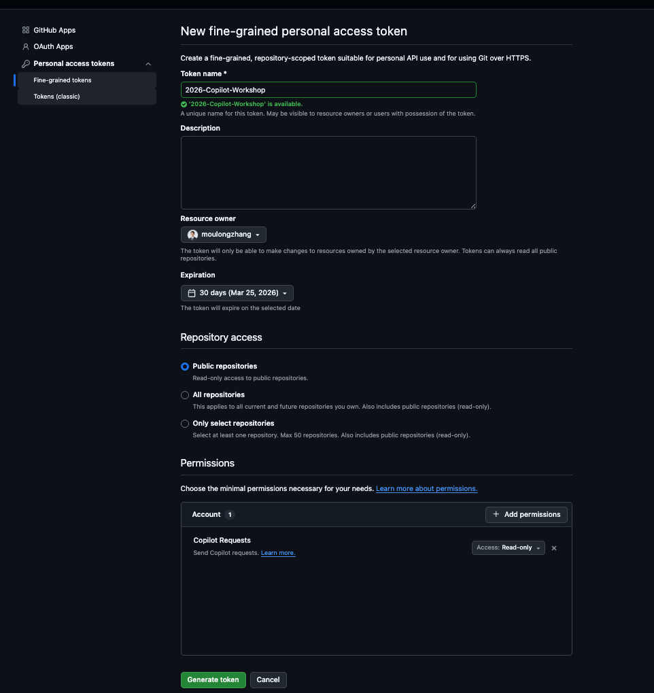

作成が完了したら、表示されたPATを必ずコピーしてください。

> **⚠️ 注意**: PATは作成直後の画面でのみ表示されます。画面遷移すると二度と確認できなくなるため、必ずこのタイミングでコピーしてください。

#### ステップ2: GitHub Actions の Repository Secret に設定

作成したPATをリポジトリのシークレットとして設定します：

1. 自分のリポジトリの **Settings** タブをクリック
2. 左サイドバーから **Secrets and variables** → **Actions** を選択
3. **New repository secret** をクリック
4. 以下の内容を入力：
   - **Name**: `COPILOT_GITHUB_TOKEN`
   - **Value**: 先ほど作成したPATを貼り付け
5. **Add secret** をクリック

#### ステップ3: Workflow permissions の確認

Cloud Agent が Pull Request を自動作成できるように、Actions のワークフロー権限を確認します：

1. 自分のリポジトリの **Settings** タブをクリック
2. 左サイドバーから **Actions** → **General** を選択
3. **Workflow permissions** セクションで **Allow GitHub Actions to create and approve pull requests** にチェックが入っていることを確認
4. チェックが入っていない場合は有効化して **Save** をクリック

> aside positive
>
> **ヒント**: この設定により、Copilot Cloud Agent が GitHub Actions のワークフロー内でCopilotの機能を利用できるようになります。

## 残りの機能を実装しよう（オプション）
Duration: 20

このセクションは **オプション** です。基本的なCopilot機能を学習済みの方で、より高度な実装に挑戦したい場合に実施してください。

ここからは、自由課題として、残りの機能を段階的に実装していきましょう。

いくつか役に立つであろうポイントをここでは紹介します。

### UIに対して指示をしたい場合

UI上の特定の要素に対して指示を出したい場合は、UIのスクリーンショットをCopilotにアップロードすることで、その要素を認識させることができます。その際、スクリーンショットの上に特に指摘したい箇所を丸で囲むなり、矢印を引くなりして、どの要素に対して指示を出したいのかを明確にすると良いでしょう。

または、現状のスクリーンショットと、期待するスクリーンショットを2枚アップロードすることで、その差分を確認してもらい、期待するUIにできるだけ近づくように指示を出すこともできます。

### 毎回同じような指示を出している場合

プロンプトを書いたり、文脈を指定する際に、頻繁に同じような指示を出している場合は、Copilotにその指示を覚えさせることができます。具体的には、プロジェクト内に `.github/copilot-instructions.md` というファイルを作成し、その中に指示を書いておきます。このファイルがあると、Copilotはその指示を自動的に読み込み、以降のチャットでその指示を参照することができます。

以下にカスタム指示のサンプルを示します。

```markdown
このプロジェクトは、ポモドーロタイマーをFlaskで実装するものです。

以下はプロジェクトの重要なファイルです。ユーザーの指示に対して、必要に応じてこれらのファイルを参照してください。
 - `pomodoro.png`: アプリケーションのUIモックです。
 - `architecture.md`: アプリケーションのアーキテクチャドキュメントです。
 - `features.md`: 実装する機能の一覧です。
 - `plan.md`: 段階的な実装計画です。
```

そのほかにも、プロジェクトをビルドするコマンドやテストを実行するコマンドなど、プロジェクトに特有のコマンドを記載しておくと、Copilotはそのコマンドを自動的に使用するようになります。

### なかなか実装が進まなかったり、バグを解決できない場合

このような場合には、以下のアプローチを試してみましょう。

- デバッグ情報を出力するように指示し、その出力をCopilotに分析させる。
- 他のモデルを試してみる。

## GitにコミットしてPushしよう
Duration: 10

作成したコードをGitリポジトリにコミットしてリモートブランチにPushしましょう。ここでは2つの方法を紹介します。

### 方法A: ターミナルでコマンドを使用

従来の方法として、ターミナルでGitコマンドを直接実行する方法です：

```
git add .
git commit -m "ポモドーロタイマー機能を追加"
git push origin feature/pomodoro
```

### 方法B: 生成AIによるコミットの作成

エージェントモードでCopilotに直接指示してコミットとPushを行います。以下のプロンプトを実行してください：

```
機能の作成が完了したので、コードの差分をgitのステージングにあげてください。

その後、適切なコミットメッセージでコミットいただき、リモートブランチに変更をPushしてください。
```


#### 【オプション】MCP サーバーによる GitHub Issues の自動起票

続いて、MCP サーバーを使用して実装計画をGitHub Issuesとして管理することもできます。

> aside negative
>
> **注意**: GitHub MCP サーバーが有効化されていない場合は、`.vscode/mcp.json` ファイル内から MCP サーバーを起動してください：
>
> ```json
> {
>   "servers": {
>     "github-mcp-server": {
>       "type": "http",
>       "url": "https://api.githubcopilot.com/mcp/"
>     }
>   }
> }
> ```

```
plan.mdの各ステップをGitHub issuesとして起票してください
```

この指示により、Copilotは以下を実行します：

1. `plan.md` の内容を読み取り
2. 各ステップを個別のIssueとして起票
3. 各Issueには以下が含まれます：
   - ステップのタイトルと詳細説明
   - 実装すべき機能の要件
   - 受け入れ条件
   - 適切なラベルと優先度

これにより、計画的なプロジェクト管理とアジャイル開発が可能になります。


> aside positive
>
> **MCP の利点**: GitHub MCPサーバーを使用することで、Copilotがリポジトリの情報、Issues、Pull Requests、ブランチ情報などのGitHubメタデータに直接アクセスし、より詳細な分析や提案を行うことができます。

## [GitHub.com] Copilot Code Review
Duration: 15

Pushした後の内容をGitHub.com上でPull Requestを立てて、Copilotのコードレビュー機能を活用しましょう。

### Pull Requestの作成とCopilot Summary

1. GitHub上で自分のリポジトリにアクセス
2. **Open a pull request** をクリック
3. Pull Request作成画面で、**Copilotのアイコン** >> **Summary** をクリック

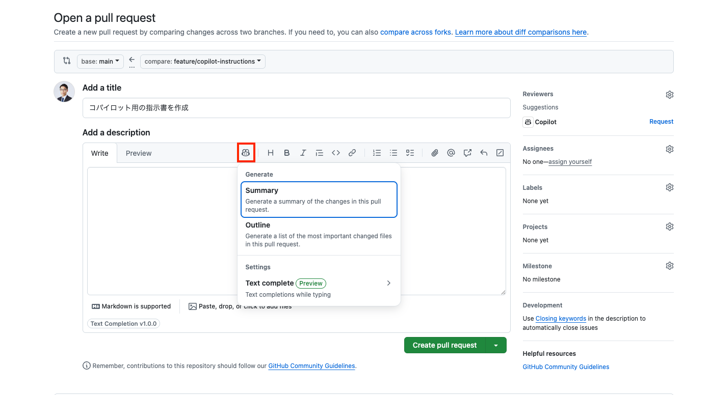

Copilotが自動的にPull Requestの概要を生成してくれます。

### Copilotをレビュワーとしてアサイン

**Reviewers** セクションで **Copilot** をアサインすることで、Copilotをレビュワーとしてアサインし、コードのレビューを依頼できます。

> aside positive
>
> **自動アサインの設定**: Settings >> Branches >> Rulesets >> Require a pull request before merging >> Automatically request Copilot code reviewにチェックを入れることで、Pull Requestを開いた時、自動的にCopilotがアサインされるようになります。


### Copilot Code Reviewの結果確認

Pull Requestが開かれた後、Copilot Code Reviewの結果を閲覧できます：

- **Pull Requestのオーバービュー**: コードの変更内容の要約
- **指摘事項**: 潜在的な問題点の指摘
- **改善提案**: コードの品質向上のための具体的な提案

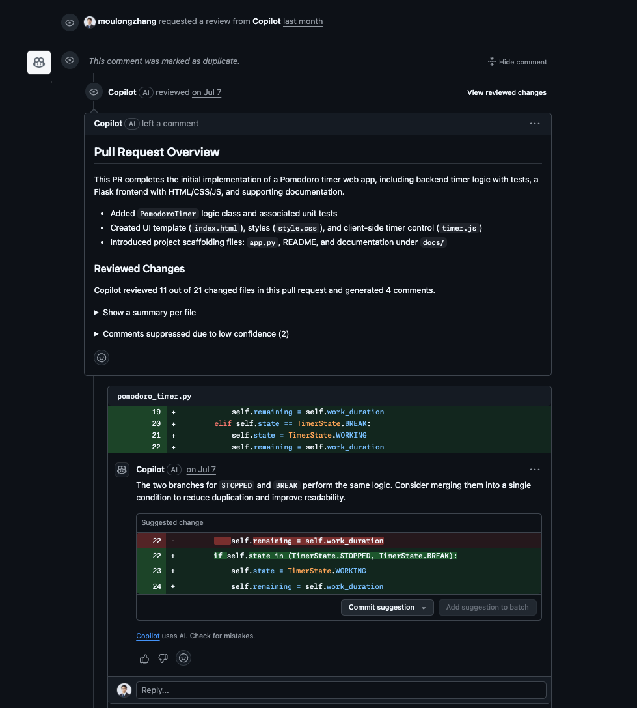

### GitHub Advanced Securityによる静的脆弱性スキャン

Pull Requestには、GitHub Advanced Security（GHAS）による静的脆弱性スキャンの結果も表示されます：

#### セキュリティアラートの確認

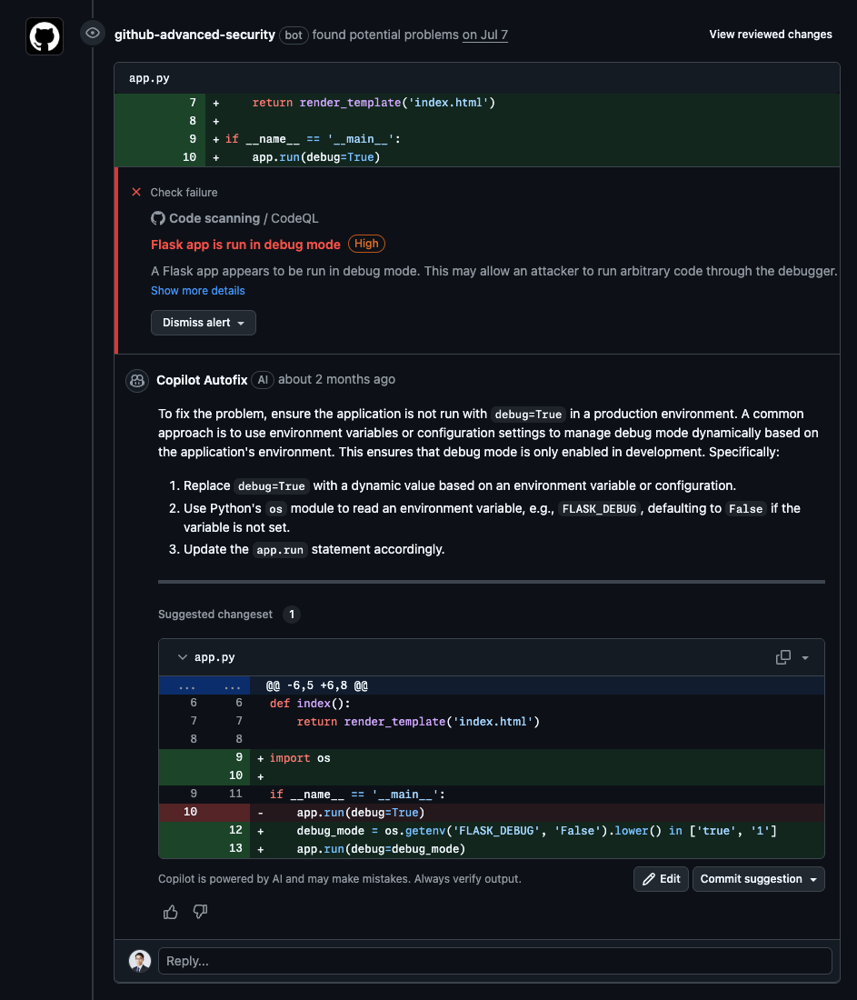

- **高セキュリティ脆弱性**: 重要度の高いセキュリティ問題
- **Copilot Autofix**: AIによる自動修正提案
- **詳細な説明**: 脆弱性の内容と修正方法

#### チェック結果の詳細


> aside positive
>
> **Copilot Autofixの活用**: GitHubは検出されたセキュリティ脆弱性に対して、Copilot Autofixによる自動修正提案を提供します。これにより、セキュリティ問題を迅速に解決できます。

## [GitHub.com] Copilot Cloud Agent
Duration: 20

GitHub CopilotのWebサイト版を使用して、プロジェクトの改善提案をIssueとして自動生成し、Cloud Agentを活用してみましょう。

### GitHub Copilotでのissue自動起票

1. **GitHub.com** にアクセスし、右上の **Copilot** アイコンをクリック
2. Chatのコンテキストに自身のリポジトリが追加されていることを確認
3. 以下のプロンプトを入力します：

```
ポモドーロタイマーのカスタマイズを行うために３つのissueを起票してください。

パターンA: 視覚的フィードバックの強化

円形プログレスバーのアニメーション: 残り時間に応じて滑らかに減少するアニメーション
色の変化: 時間経過に応じて青→黄→赤にグラデーション変化
背景エフェクト: 集中時間中は背景にパーティクルエフェクトや波紋アニメーション
テスト目的: 視覚的な没入感がユーザーの集中力に与える影響を測定

パターンB: カスタマイズ性の向上

時間設定の柔軟化: 25分固定ではなく、15/25/35/45分から選択可能
テーマ切り替え: ダーク/ライト/フォーカスモード（ミニマル）
サウンド設定: 開始音/終了音/tick音のオン/オフ切り替え
休憩時間カスタム: 5/10/15分から選択
テスト目的: 個人の好みに合わせた設定がユーザー継続率に与える影響を測定

パターンC: ゲーミフィケーション要素の追加

経験値システム: 完了したポモドーロに応じてXPとレベルアップ
達成バッジ: 「3日連続」「今週10回完了」などの実績システム
週間/月間統計: より詳細なグラフ表示（完了率、平均集中時間など）
ストリーク表示: 連続日数のカウント表示
テスト目的: ゲーミフィケーション要素がモチベーション維持と継続利用に与える影響を測定
```


### Issueの作成とCloud Agentのアサイン

1. **Copilotが3つのIssueを自動生成**します
2. 各Issueの内容を確認し、必要に応じて編集
3. **Create** ボタンをクリックして各Issueを作成
4. Issue画面に遷移後、**Assignees** セクションで **Copilot** を選択してCloud Agentをアサイン


### 期待されるPull Requestの結果

Cloud Agentがアサインされると、以下のような結果が期待できます：

- **自動的なコード実装**: 各Issueの要件に基づいた機能実装
- **Pull Requestの作成**: 実装完了後の自動PR作成
- **包括的なテスト**: 単体テストとUIテストの両方を含む

#### パターンA: 視覚的フィードバックの強化

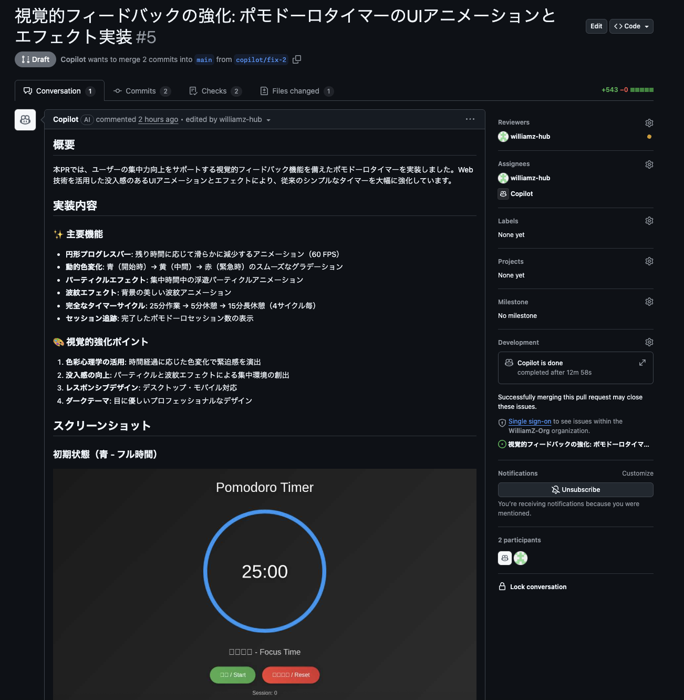

#### パターンB: カスタマイズ性の向上


#### パターンC: ゲーミフィケーション要素の追加


> aside positive
>
> **MCP Serverの活用**: GitHub MCP ServerとPlaywright MCP Serverが初期設定としてCloud Agentに含まれています。これにより、単体テストだけではなく、スクリーンショットによるUIの自動チェックも行うことができます。Cloud Agentは実装した機能が期待通りに動作するかを視覚的に検証し、より品質の高いコードを提供します。

## [GitHub.com] Agentic Workflow
Duration: 15

GitHub Actions と Copilot を組み合わせることで、コードの変更を検知して自動的にドキュメントを更新する **Agentic Workflow** を体験しましょう。

### Agentic Workflow とは

Agentic Workflow は、GitHub Actions のワークフロー内で Copilot（AI）を活用し、コードの変更に応じた自律的なタスクを実行する仕組みです。今回のワークショップでは、ポモドーロタイマーのコードに変更が加わった際に、関連するドキュメントを自動更新するワークフローが事前に設定されています。

### 1. Pull Request を main ブランチにマージする

前のステップで作成した Pull Request を main ブランチにマージしてください。

1. GitHub 上で自分のリポジトリにアクセス
2. **Pull requests** タブをクリック
3. 対象の Pull Request を開く
4. **Merge pull request** ボタンをクリックしてマージを実行


### 2. ワークフローの実行を確認する

先ほどコードを Push したことで、Agentic Workflow が自動的にトリガーされています。

1. GitHub 上で自分のリポジトリにアクセス
2. **Actions** タブをクリック
3. **Pomodoro Documentation Sync** ワークフローが実行されていることを確認

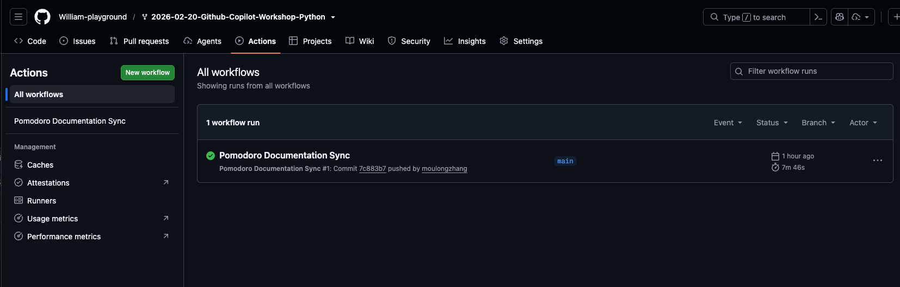

このワークフローは、`pomodoro/` 配下のコードに差分が生じたときに、変更内容に応じて `pomodoro/docs/` 配下で管理しているドキュメンテーションを自動的に更新するものです。

### 3. Pull Request を確認する

Actions の実行が完了すると、ドキュメンテーションを更新する **Pull Request** が自動的に作成されます。

1. **Pull requests** タブをクリック
2. Copilot が作成した PR を確認
3. ドキュメントの変更内容をレビュー

### 4. 自分で Agentic Workflow を作ってみよう

ここまでで Agentic Workflow の動作を確認できました。次は、自分自身で Agentic Workflow を作成してみましょう。

エージェントモードで以下のプロンプトを実行してください：

```
以下のURLを参照して GitHub Agentic Workflow を作成してください。
https://github.com/github/gh-aw/blob/main/create.md

ワークフローの目的は以下のとおりです：
- copilotWebRelay 配下のコードが更新された時に実行されます
- copilotWebRelay 配下のコードの内容に応じて copilotWebRelay/docs のドキュメンテーションを更新し、ソースコードとドキュメンテーションが常に一致するようにします

作成したワークフローファイルをコミットし、Pull Requestを作成してください。
```

> aside positive
>
> **Agentic Workflow の可能性**: ドキュメント更新以外にも、テストの自動生成、コードレビューの自動化、リリースノートの作成など、様々なタスクを Agentic Workflow として構築できます。

## Copilot SDK で AI チャットツールを作ろう
Duration: 10

ここからは、**Copilot SDK** を使って、ブラウザ上で動作する生成 AI チャットツール「**Copilot Web Relay**」を **Copilot CLI から1つのプロンプトで** 構築します。

### Copilot SDK とは？

**Copilot SDK** は、GitHub Copilot CLI をプログラムから制御するための SDK です。JSON-RPC を介して Copilot CLI と通信し、AI セッションの作成・メッセージの送受信・ストリーミングレスポンスの取得などをアプリケーションに組み込むことができます。

**SDK リポジトリ**: [https://github.com/github/copilot-sdk](https://github.com/github/copilot-sdk)

### 何を作るか

ブラウザから AI とリアルタイムにチャットできる Web アプリケーションを作ります：

- **フロントエンド**: ブラウザ上のチャット UI（React + TypeScript）
- **バックエンド**: Copilot SDK を使って AI セッションを管理する Node.js サーバー
- **リアルタイム通信**: WebSocket でストリーミングレスポンスを配信

### Copilot SDK の主要 API

| API | 説明 |
|---|---|
| `CopilotClient` | CLI サーバーとの接続を管理するクライアント |
| `client.createSession()` | 新しい会話セッションを作成 |
| `session.send()` | メッセージを送信 |
| `session.on("assistant.message_delta")` | ストリーミングレスポンスのチャンクを受信 |
| `session.on("assistant.message")` | 最終レスポンスを受信 |
| `session.on("session.idle")` | セッションの処理完了を検知 |
| `approveAll` | すべてのツール実行パーミッションを自動許可 |
| `createChatTools()` | チャット用の標準ツールセットを生成 |
| `hooks.onPreToolUse` | ツール実行前のフック（入力の検証・変換などに使用） |
| `hooks.onPostToolUse` | ツール実行後のフック（結果のログ・加工などに使用） |

### SDK の基本的な使い方

```javascript
import { CopilotClient, approveAll, createChatTools } from "@github/copilot-sdk";

const client = new CopilotClient();
await client.start();

const session = await client.createSession({
    model: "gpt-5",
    onPermissionRequest: approveAll,
    tools: createChatTools(),
    hooks: {
        onPreToolUse: (input, invocation) => {
            console.log(`ツール実行前: ${invocation.toolName}`, input);
        },
        onPostToolUse: (input, invocation) => {
            console.log(`ツール実行後: ${invocation.toolName}`, input);
        },
    },
});

session.on("assistant.message_delta", (event) => {
    process.stdout.write(event.data.deltaContent);
});

await session.send({ prompt: "Hello!" });
```

> aside positive
>
> **このセクションのポイント**: 設計書や細かい仕様書を用意することなく、Copilot CLI に **1つのプロンプト** を投げるだけで、SDK を活用した Web アプリケーションを一気に構築します。AI 駆動開発の生産性を体感してください。

## Vibe Coding で実装しよう
Duration: 60

Copilot SDK の概要を理解したら、いよいよ **Vibe Coding** でブラウザ AI チャットツールを実装していきます。

### ステップ 1: Copilot CLI を起動する

VS Code のターミナルで Copilot CLI を起動します。

```bash
copilot
```

### ステップ 2: すべてのパーミッションを許可する

```
/allow-all
```

`/allow-all` は、Copilot CLI に対して**ツールの実行・ファイルアクセス・外部URLへのアクセス**のすべてのパーミッションを一括で許可するコマンドです。

通常、Copilot CLI はセキュリティのために、ファイルの読み書きやコマンドの実行、外部通信を行う際にユーザーへ都度許可を求めます。`/allow-all` を実行することで、これらの確認プロンプトをスキップし、Copilot がファイルの作成・編集、パッケージのインストール、サーバーの起動などを自律的に実行できるようになります。

> aside negative
>
> **注意**: `/allow-all` は現在のセッションに対してのみ有効です。セキュリティ上、信頼できるプロジェクトでのみ使用してください。個別に許可したい場合は、`/add-dir` でディレクトリ単位のアクセス許可を設定することもできます。

### ステップ 3: ハイエンドモデルを選択する

```
/model
```

モデル一覧から最も高性能なモデル（例: Claude Opus 4.6）を選択してください。複数コンポーネントを持つ Web アプリケーションの構築には、推論能力の高いハイエンドモデルが効果的です。

### ステップ 4: Autopilot モードに切り替える

**Shift+Tab** を押して、Copilot CLI を **Autopilot モード** に切り替えてください。Autopilot モードでは、Copilot がファイルの作成・編集やコマンドの実行を確認なしで自律的に進めるため、大規模な実装を一気に行う Vibe Coding に最適です。

### ステップ 5: 1プロンプトで一気に実装する

以下のプロンプトを Copilot CLI に投げてください。`/fleet` コマンドで複数のエージェントが並列に動作し、SDK を使ったブラウザ AI チャットツールを一気に構築します：

```
/fleet Copilot SDK を使って、ブラウザ上で動作する AI チャット Web アプリケーションを copilotWebRelay/ ディレクトリに構築してください。

SDK リファレンス: https://github.com/github/copilot-sdk

要件:
- バックエンド: Node.js + Express + WebSocket サーバー
  - Copilot SDK の CopilotClient でセッションを管理
  - createSession() でモデル "gpt-5" を使用、onPermissionRequest には approveAll を使用
  - session.on("assistant.message_delta") でストリーミングレスポンスを WebSocket 経由でクライアントに配信
  - session.on("session.idle") で完了を通知
- フロントエンド: React + TypeScript + Vite
  - モダンなチャット UI（メッセージ入力欄、送信ボタン、チャット履歴表示）
  - WebSocket でサーバーに接続し、ストリーミングレスポンスをリアルタイム表示
  - Markdown レンダリング対応
- 開発環境: npm scripts でバックエンドとフロントエンドを同時起動できること
- 動作確認まで行ってください
```

> aside positive
>
> **1プロンプトのコツ**: 要件を箇条書きで構造化し、使用する技術スタック・SDK の API・期待する動作を明確に伝えることで、Copilot が正確にアプリケーションを構築してくれます。

### つまずいた場合のヒント

実装でエラーが発生した場合は、以下を試してみましょう：

- **エラーメッセージをそのまま Copilot に共有**: 「このエラーを修正してください」と伝えるだけで修正してくれます
- **`/diff` で変更内容を確認**: 意図しない変更がないかチェック
- **`/model` でモデルを変更**: 別のモデルに切り替えて再試行

> aside negative
>
> **よくあるつまずきポイント**:
> - **Copilot SDK のインストール**: `npm install @github/copilot-sdk` が正しく実行されていることを確認
> - **認証**: Copilot CLI がログイン済みであること（`copilot` コマンドが動作すること）
> - **Vite の WebSocket プロキシ**: `target` に `ws://` ではなく `http://` を指定する必要があります
> - **React StrictMode**: `useEffect` が2回実行される問題で WebSocket 接続が不安定になることがあります

## Copilot Code Review — 複数モデルによるコードレビュー
Duration: 30

Copilot Web Relay の実装が完了したら、**Copilot CLI のレビュー関連コマンド** を使って、複数の AI モデルでコードレビューを行いましょう。異なるモデルの視点から品質・セキュリティ・パフォーマンスの問題を多角的に検出することがゴールです。

### レビューに使う主なコマンド

Copilot CLI にはコードレビューに活用できるコマンドが複数用意されています。

| コマンド | 説明 |
|---|---|
| `/review` | コードレビューエージェントを実行して変更を分析する |
| `/model` | 使用する AI モデルを選択する（Claude、GPT、Gemini 等） |
| `/undo` | 直前のターンを巻き戻し、ファイル変更を元に戻す |

### ステップ 1: コードをコミット & Push する

Copilot CLI で以下のように指示して、実装をコミット & Push します：

```
実装した Copilot Web Relay のコードをすべて git add して、適切なコミットメッセージでコミットし、feature/copilot-web-relay ブランチにプッシュして、main ブランチへの Pull Request を作成してください。
```

### ステップ 2: 複数モデルでレビュー & Pull Request にコメント

Copilot CLI で以下のプロンプトを入力して、複数モデルによるレビューから PR コメントまでを一気に実行します：

```
/review opus4.6, GPT5.4の各モデルでPull Requestをレビューいただき、結果をまとめていただき、結果をPull Requestにコメントとして残してください
```

このプロンプトだけで、以下が自動的に実行されます：

- **Claude Opus 4.6** によるコードレビュー
- **GPT-5.4** によるコードレビュー
- 各モデルのレビュー結果の統合・比較
- Pull Request へのレビューコメントの投稿

修正に問題があった場合は、`/undo` で直前のターンを巻き戻してファイル変更を元に戻すことができます。

> aside positive
>
> **複数モデルレビューのメリット**:
> - **Claude**: 論理的な整合性やエッジケースの検出に強い
> - **GPT**: 幅広いベストプラクティスの指摘が得意
>
> 複数のモデルが共通して指摘する問題は、信頼度が高く優先的に修正すべき問題です。

> aside positive
>
> **CLIレビューとGitHub.comのCode Reviewの使い分け**:
> - **`/review`（CLI）**: ローカルの変更差分を対象に即座にレビューを実行。開発中の早い段階で問題を検出できる
> - **Copilot Code Review**: Pull Request の差分を対象に、フォーマルなレビューコメントを残す。チームでのレビューフローに最適
>
> 両方を組み合わせることで、開発の早い段階から品質を担保できます。

## コードを理解＆改善しよう
Duration: 20

Vibe Coding で実装した Copilot SDK チャットツールのコードを、Copilot に解説してもらい理解を深めましょう。その後、問題点を見つけて改善まで行います。

### 1. コード全体の解説を依頼

まずは、実装されたコードの全体像を把握しましょう。エージェントモードで以下のプロンプトを入力してください：

```
copilotWebRelay/ 配下の AI チャットアプリケーションのコード全体を確認して、アーキテクチャ、各ファイルの役割、主要な処理の流れを解説してください。特に Copilot SDK の使い方（CopilotClient、createSession、ストリーミングレスポンス）がどのように実装されているかを重点的に説明してください。
```

Copilot エージェントはプロジェクト内のファイルを自動的にスキャンし、コードの構造や処理の流れを解説してくれます。

> aside positive
>
> **ヒント**: エージェントモードでは、Copilot が自動的にプロジェクト内のファイルを参照して回答してくれるため、手動でファイルをコンテキストに追加する必要がありません。

### 2. 問題点を見つける

次に、コードの品質やセキュリティの観点から問題点を洗い出してもらいましょう：

```
copilotWebRelay/ 配下のアプリケーション全体を見て、どのような問題点や改善点がありますか？設計パターン、コードの品質、保守性、セキュリティの観点から教えてください。
```

さらに、特定のコンポーネントに絞って深掘りすることもできます：

```
バックエンドの WebSocket サーバーと Copilot SDK セッション管理に問題はありますか？エラーハンドリングやリソース管理の改善案を提案してください。
```

```
フロントエンドの WebSocket 接続管理やストリーミングレスポンスの表示に問題はありますか？React のベストプラクティスに従っているか確認してください。
```

### 3. 改善案を実装する

見つかった問題点を実際に修正してもらいましょう：

```
提示してくれたすべての改善案を実装してください。
```

Copilot はコードに対して直接変更を提案します。変更内容を確認し、チャット欄の「保持」もしくは「元に戻す」ボタンで受け入れるかどうかを決定しましょう。

### 4. 動作確認

改善を実装した後は、アプリケーションが引き続き正常に動作することを確認しましょう：

```
改善を実装した結果、アプリケーションが正常に動作することを確認してください。バックエンドの起動、フロントエンドのビルド、ブラウザでの動作確認を行ってください。
```

> aside positive
>
> **重要**: エージェントモードでは、Copilot がより自律的に動作するため、提案される変更内容をよく確認してから受け入れるようにしましょう。エージェントはコード変更後にエラーが発生した場合、自動的に検出して修正を試みることもあります。

## おめでとうございます 🎉
Duration: 5

### 今日学んだこと

このワークショップでは以下のことを学びました：

1. **GitHub Copilot の基本的な使い方**
2. **エージェントモードでのコードの解説・改善**
3. **AI をコントロールしながら実装するスペック駆動開発**
4. **強力なモデルとツールを用いた AI 駆動開発**
5. **Copilot SDK を活用した AI を内包したアプリケーション開発**

### 次のステップ

- 実際のプロジェクトでCopilotを活用してみる
- より複雑なアプリケーション開発に挑戦する
- Copilotの新機能をキャッチアップする
- Copilot Web Relay を自身の環境にデプロイしてみる

### リソース

- [GitHub Copilot Documentation](https://docs.github.com/copilot)
- [GitHub Copilot ベストプラクティス](https://docs.github.com/copilot/using-github-copilot/best-practices-for-using-github-copilot)

お疲れさまでした！