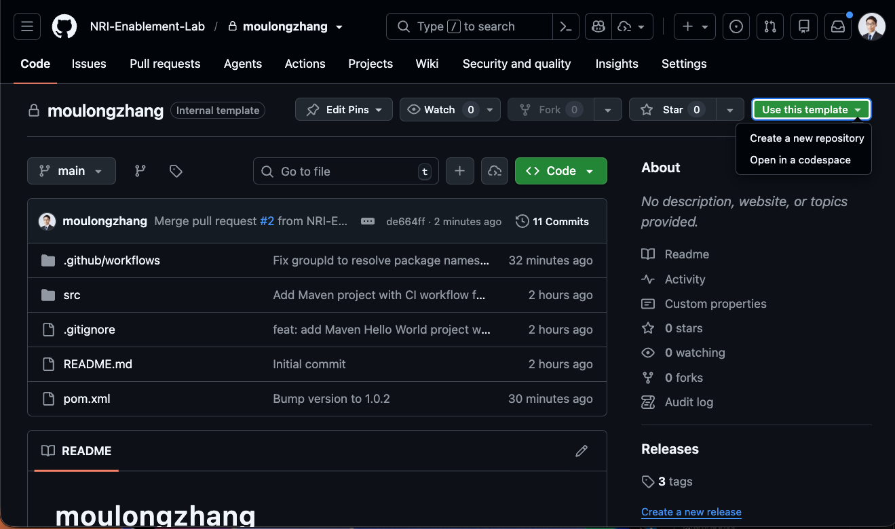

author: Your Name
summary: NRI GitHub Copilot ワークショップ
id: github-copilot-workshop
categories: AI, Development
environments: Web
status: Published
feedback link: https://example.com/feedback

# NRI GitHub Copilot ワークショップ

## ワークショップについて
Duration: 5

GitHub Copilotワークショップへようこそ！


### 本日のゴール
- Agentic Workflow
- GitHub Copilot CLI

## プロジェクトのセットアップ
Duration: 15

このワークショップでは、以下のGitHubリポジトリを使用します：

**プロジェクトURL**: https://github.com/NRI-Enablement-Lab/moulongzhang

### ステップ1: テンプレートからリポジトリを作成する

まず、上記のプロジェクトURLをブラウザで開き、テンプレートから自分のリポジトリを作成します：

1. プロジェクトURL（https://github.com/NRI-Enablement-Lab/moulongzhang）をブラウザで開く
2. 右上の **Use this template** ボタンをクリックし、**Create a new repository** を選択



テンプレートからの作成が完了すると、あなたのGitHubアカウントに新しいリポジトリが作成されます。

### ステップ2: 開発環境のセットアップ

作成したリポジトリを使って、GitHub Codespacesで開発環境を準備します：

1. 作成したリポジトリのページで（`https://github.com/NRI-Enablement-Lab/[あなたのリポジトリ名]`）
2. 緑色の **Code** ボタンをクリック
3. **Codespaces** タブを選択
4. **Create codespace on main** をクリック


## Agentic Workflow
Duration: 15

GitHub Actions と Copilot を組み合わせることで、自律的なタスクを実行する Agentic Workflow を体験しましょう。

### Agentic Workflow とは

Agentic Workflow は、GitHub Actions のワークフロー内で Copilot（AI）を活用し、コードの変更に応じた自律的なタスクを実行する仕組みです。

### Auto Healing DevOps の作成

CI/CD のジョブが失敗した時にそれらを検知し、修正するワークフローを作成します。

#### 一つ目のプロンプト

Copilot に以下のプロンプトを入力してください：

```
以下のURLを参照して GitHub Agentic Workflow を作成してください。
https://github.com/github/gh-aw/blob/main/create.md

ワークフローの目的は以下のとおりです：
リポジトリで失敗したワークフロー実行を検知し、原因を分析してIssueを自動作成する。
作成したissueにはCopilotを自動アサインする。
```

#### 二つ目のプロンプト

ワークフローが作成できたら、意図的にビルドを失敗させて動作を確認します。Copilot に以下のプロンプトを入力してください：

```
System.out.println("Hello World!"); を System.out.println("Hell World!"); にして push して
```

Push 後、GitHub Actions のワークフローが失敗を検知し、Copilot が自動的に Issue を作成してアサインされることを確認しましょう。

### ドキュメントの自動更新

コードに変更が加わった際に、関連するドキュメントを自動更新するワークフローを作成します。

Copilot に以下のプロンプトを入力してください：

```
以下のURLを参照して GitHub Agentic Workflow を作成してください。
https://github.com/github/gh-aw/blob/main/create.md

ワークフローの目的は以下のとおりです：
- copilotWebRelay 配下のコードが更新された時に実行されます
- copilotWebRelay 配下のコードの内容に応じて copilotWebRelay/docs のドキュメンテーションを更新し、ソースコードとドキュメンテーションが常に一致するようにします
```

## Copilot Web Relay を作ろう
Duration: 10

ここからは上級編として、**Copilot Web Relay** — ブラウザから GitHub Copilot CLI にアクセスできる Web アプリケーションを構築します。

このセクションでは、ポモドーロタイマーとは異なるアプローチを取ります。**事前に用意された設計書をCopilotに読み込ませ、設計書をもとに対話しながら段階的に実装していく**ワークフローを体験します。


### Copilot Web Relay とは？

ローカルで動作する GitHub Copilot CLI を、ターミナルを直接操作することなくブラウザ上のUIを通じてリアルタイムにやり取りできるようにするWebアプリケーションです。

### アーキテクチャ概要

| コンポーネント | 技術スタック | 役割 |
|---|---|---|
| **Browser** | React + TypeScript + Vite | ターミナル表示（xterm.js）、セッション管理 |
| **Backend Server** | Python (FastAPI) + WebSocket | Copilot CLI プロセスの管理、WebSocket ブリッジ |
| **CLI Bridge** | Python (asyncio + pexpect) | Copilot CLI の PTY（疑似端末）制御、入出力のストリーミング |

Browser ↔ WebSocket（双方向通信）↔ Backend Server ↔ PTY/stdin/stdout（子プロセス管理）↔ Copilot CLI

### 開発の進め方

このセクションでは以下の流れで進めます：

1. **設計書を確認** — プロジェクトに配布された設計書を確認し、アプリケーションの全体像を理解する
2. **GitHub Copilot CLI** — ターミナルで CLI を立ち上げ、問題なく動作することを確認する
3. **AI 駆動開発** — 設計書を活用し、GitHub Copilot CLI と対話しながら Web アプリケーションを Vibe Coding で実装する

> aside positive
>
> **このセクションのポイント**: Copilotのハイエンドモデルを GitHub Copilot の最新機能と組み合わせて利用した時に実現できるタスクの質と量を体感いただくことがゴールです。設計書を事前に用意しておくことで、Copilotに対して「何を作るか」の文脈を明確に伝えられます。実際の開発現場でも、設計ドキュメントをCopilotのコンテキストとして活用するのは非常に効果的なプラクティスです。

## 設計書の確認と GitHub Copilot CLI
Duration: 15

### 1. 設計書の確認

プロジェクト内の `copilotWebRelay/planning.md` に、Copilot Web Relay の設計書が配布されています。まずはこのファイルを開いて、アプリケーションの全体像を確認しましょう。

設計書には以下の内容が含まれています：

- **アーキテクチャ**: Browser ↔ WebSocket ↔ FastAPI ↔ PTY ↔ Copilot CLI の構成
- **コンポーネント構成**: Frontend（React/TS）、Backend（FastAPI）、CLI Bridge（pexpect）
- **機能要件**: Phase 1（MVP）と Phase 2（チャット UI 強化）
- **WebSocket プロトコル設計**: メッセージ形式と状態管理の仕様
- **ディレクトリ構造**: ファイル配置と各ファイルの役割
- **実装タスク一覧**: タスク間の依存関係
- **実装上の重要な注意事項**: つまずきやすいポイントの事前対策

> aside positive
>
> **設計書を活用するコツ**: この後の実装フェーズでは、GitHub Copilot CLI に対してプロンプトを投げる際に `planning.md を参照して` と指示することで、Copilot が設計書の文脈を理解した上でコードを生成してくれます。

### 2. GitHub Copilot CLI の起動確認

VS Code のターミナルを開き、以下のコマンドを入力して GitHub Copilot CLI を起動してみましょう：

```bash
copilot
```

正常に起動すると、対話型のインターフェースが表示されます。`/help` と入力して、利用可能なコマンドを確認してみましょう。

> aside negative
>
> **GitHub Copilot CLI のセットアップについて**
> 通常、GitHub Copilot CLI を利用するには **GitHub CLI (`gh`)** のインストールと Copilot 拡張機能のセットアップが必要です。今回のワークショップでは、**DevContainer の設定に GitHub Copilot CLI のインストールと認証が含まれている**ため、Codespaces を起動すれば `copilot` コマンドがすぐに利用できます。
>
> 自身の環境でセットアップする場合は、以下の手順が必要です：
> 1. GitHub CLI をインストール: `brew install gh`（macOS）
> 2. GitHub CLI で認証: `gh auth login`
> 3. Copilot 拡張機能をインストール: `gh extension install github/copilot-cli`

### 3. GitHub Copilot CLI のコマンド一覧

GitHub Copilot CLI では、テキストで自然言語の指示を入力するほか、`/` で始まるスラッシュコマンドを使用できます。

#### コード関連

| コマンド | 説明 |
|---|---|
| `/ide` | IDE ワークスペースに接続 |
| `/diff` | 現在のディレクトリの変更差分を確認 |
| `/review` | コードレビューエージェントを実行して変更を分析 |
| `/lsp` | 言語サーバーの設定を管理 |
| `/terminal-setup` | マルチライン入力（Shift+Enter / Ctrl+Enter）のターミナル設定 |

#### パーミッション

| コマンド | 説明 |
|---|---|
| `/allow-all` | すべてのパーミッション（ツール・パス・URL）を有効化 |
| `/add-dir` | ファイルアクセスの許可ディレクトリを追加 |
| `/list-dirs` | 許可されたディレクトリの一覧を表示 |
| `/cwd` | 作業ディレクトリを変更または表示 |
| `/reset-allowed-tools` | 許可ツールのリストをリセット |

#### セッション管理

| コマンド | 説明 |
|---|---|
| `/resume` | 別のセッションに切り替え（セッションID指定可） |
| `/rename` | 現在のセッション名を変更 |
| `/context` | コンテキストウィンドウのトークン使用量を表示 |
| `/usage` | セッションの使用状況メトリクスと統計を表示 |
| `/session` | セッション情報とワークスペースサマリーを表示 |
| `/compact` | 会話履歴を要約してコンテキストウィンドウの使用量を削減 |
| `/share` | セッションを Markdown ファイルまたは GitHub Gist としてエクスポート |

#### ヘルプ・フィードバック

| コマンド | 説明 |
|---|---|
| `/help` | 対話コマンドのヘルプを表示 |
| `/changelog` | CLI バージョンの変更履歴を表示 |
| `/feedback` | CLI に関するフィードバックを送信 |
| `/theme` | ターミナルテーマの確認・設定 |
| `/experimental` | 利用可能な実験的機能の表示、実験モードの切り替え |

#### その他

| コマンド | 説明 |
|---|---|
| `/model` | 使用する AI モデルを選択（GPT、Claude、Gemini 等） |
| `/clear` , `/new` | 会話履歴をクリア |
| `/plan` | コーディング前に実装計画を作成 |
| `/instructions` | カスタム指示ファイルの表示・切り替え |
| `/diagnose` | 現在のセッションログを分析 |
| `/login` , `/logout` | Copilot へのログイン・ログアウト |
| `/user` | GitHub ユーザーの管理 |
| `/exit` , `/quit` | CLI を終了 |

#### カスタム指示ファイル

Copilot CLI は以下の場所にあるカスタム指示ファイルを自動的に読み込みます：

- `CLAUDE.md` / `GEMINI.md` / `AGENTS.md`（git ルートおよびカレントディレクトリ）
- `.github/instructions/**/*.instructions.md`（git ルートおよびカレントディレクトリ）
- `.github/copilot-instructions.md`
- `$HOME/.copilot/copilot-instructions.md`

> aside positive
>
> **CLI のヒント**: `/model` コマンドでモデルを切り替えることができます。実装がうまく進まない場合は、別のモデルを試してみると良い結果が得られることがあります。`/plan` コマンドを使うとコーディング前に実装計画を自動生成できるので、設計書と組み合わせると効果的です。

## Vibe Coding で実装しよう
Duration: 60

設計書の確認と GitHub Copilot CLI の動作確認ができたら、いよいよ **Vibe Coding** で Copilot Web Relay を実装していきます。

以下の 4 ステップを順番に実行するだけで、Copilot が設計書をもとにアプリケーションを構築してくれます。

### ステップ 1: Copilot CLI を起動する

VS Code のターミナルで Copilot CLI を起動します。

```bash
copilot
```

### ステップ 2: すべてのパーミッションを許可する

```
/allow-all
```

`/allow-all` は、Copilot CLI に対して**ツールの実行・ファイルアクセス・外部URLへのアクセス**のすべてのパーミッションを一括で許可するコマンドです。

通常、Copilot CLI はセキュリティのために、ファイルの読み書きやコマンドの実行、外部通信を行う際にユーザーへ都度許可を求めます。`/allow-all` を実行することで、これらの確認プロンプトをスキップし、Copilot がファイルの作成・編集、パッケージのインストール、サーバーの起動などを自律的に実行できるようになります。

> aside negative
>
> **注意**: `/allow-all` は現在のセッションに対してのみ有効です。セキュリティ上、信頼できるプロジェクトでのみ使用してください。個別に許可したい場合は、`/add-dir` でディレクトリ単位のアクセス許可を設定することもできます。

### ステップ 3: ハイエンドモデルを選択する

```
/model Claude Opus 4.6
```

最も高性能なモデルを選択します。Copilot CLI は `/model` コマンドで使用する AI モデルを切り替えることができ、タスクの複雑さに応じて最適なモデルを選べます。今回のような複数コンポーネントを持つ Web アプリケーションの構築には、推論能力の高いハイエンドモデルが効果的です。

### ステップ 4: Fleet モードで一気に実装する

```
/fleet Copilot Web Relay — ブラウザから GitHub Copilot CLI にアクセスできる Web アプリケーションを構築します。copilotWebRelay/planning.md の計画に沿って実装を進めてください。不明なことがあれば事前に私に聞いてください。
```

`/fleet` は、**複数のサブエージェントを並行して起動し、大規模なタスクを分割・同時実行する**ためのコマンドです。

通常の Copilot CLI では 1 つのタスクを順番に処理しますが、`/fleet` を使うと Copilot が自動的にタスクを分解し、バックエンドの実装・フロントエンドの実装・設定ファイルの作成など複数の作業を**並行して進めます**。これにより、従来1つずつ指示して進めていた作業を、一度の指示で一気に完成させることができます。

Fleet モードでは以下のことが自動的に行われます：

- **タスクの分解**: 設計書を読み取り、実装すべきコンポーネントを特定
- **並行実装**: バックエンド（FastAPI + CLI Bridge + WebSocket）とフロントエンド（React + xterm.js）を同時に実装
- **依存関係の解決**: パッケージのインストール、設定ファイルの生成
- **統合テスト**: 実装後の動作確認

> aside positive
>
> **Fleet モードのポイント**: Copilot が質問してきた場合は、適切に回答してください。設計書に記載されている内容であれば「planning.md を参照してください」と返答するのも効果的です。実装の進行状況はターミナルにリアルタイムで表示されます。

### つまずいた場合のヒント

Fleet モードの実装でエラーが発生した場合は、以下を試してみましょう：

- **エラーメッセージをそのまま Copilot に共有**: 「このエラーを修正してください」と伝えるだけで修正してくれます
- **`/diff` で変更内容を確認**: 意図しない変更がないかチェック
- **`/model` でモデルを変更**: 別のモデルに切り替えて再試行
- **設計書の注意事項を確認**: `planning.md` の「実装上の重要な注意事項」セクションに、よくあるバグの対処法が記載されています

> aside negative
>
> **よくあるつまずきポイント**:
> - **Vite の WebSocket プロキシ**: `target` に `ws://` ではなく `http://` を指定する必要があります
> - **React StrictMode**: `useEffect` が2回実行される問題で WebSocket 接続が不安定になることがあります
> - **FastAPI のルーティング順序**: StaticFiles のマウントは WebSocket エンドポイントの後に定義する必要があります
> - **xterm.js v5 のパッケージ名**: `xterm-addon-fit` ではなく `@xterm/addon-fit` を使用してください

以下が、私の場合の1ショットでプロンプトを流した実装結果です。


## コードを理解＆改善しよう
Duration: 20

Vibe Coding で実装した Copilot Web Relay のコードを、Copilot に解説してもらい理解を深めましょう。その後、問題点を見つけて改善まで行います。

### 1. コード全体の解説を依頼

まずは、実装されたコードの全体像を把握しましょう。エージェントモードで以下のプロンプトを入力してください：

```
この Copilot Web Relay アプリケーションのコード全体を確認して、アーキテクチャ、各ファイルの役割、主要な処理の流れを解説してください。
```

Copilot エージェントはプロジェクト内のファイルを自動的にスキャンし、コードの構造や処理の流れを解説してくれます。

> aside positive
>
> **ヒント**: エージェントモードでは、Copilot が自動的にプロジェクト内のファイルを参照して回答してくれるため、手動でファイルをコンテキストに追加する必要がありません。

### 2. 問題点を見つける

次に、コードの品質やセキュリティの観点から問題点を洗い出してもらいましょう：

```
この Copilot Web Relay アプリケーション全体を見て、どのような問題点や改善点がありますか？設計パターン、コードの品質、保守性、セキュリティの観点から教えてください。
```

さらに、特定のコンポーネントに絞って深掘りすることもできます：

```
backend/cli_bridge.py のエラーハンドリングとリソース管理に問題はありますか？改善案を提案してください。
```

```
frontend/src/App.tsx の WebSocket 接続管理に問題はありますか？React のベストプラクティスに従っているか確認してください。
```

### 3. 改善案を実装する

見つかった問題点を実際に修正してもらいましょう：

```
提示してくれたすべての改善案を実装してください。
```

Copilot はコードに対して直接変更を提案します。変更内容を確認し、チャット欄の「保持」もしくは「元に戻す」ボタンで受け入れるかどうかを決定しましょう。

### 4. 動作確認

改善を実装した後は、アプリケーションが引き続き正常に動作することを確認しましょう：

```
改善を実装した結果、アプリケーションが正常に動作することを確認してください。バックエンドの起動、フロントエンドのビルド、ブラウザでの動作確認を行ってください。
```

> aside positive
>
> **重要**: エージェントモードでは、Copilot がより自律的に動作するため、提案される変更内容をよく確認してから受け入れるようにしましょう。エージェントはコード変更後にエラーが発生した場合、自動的に検出して修正を試みることもあります。

## おめでとうございます 🎉
Duration: 5

### 今日学んだこと

このワークショップでは以下のことを学びました：

1. **GitHub Copilot の基本的な使い方**
2. **エージェントモードでのコードの解説・改善**
3. **AI をコントロールしながら実装するスペック駆動開発**
4. **強力なモデルとツールを用いた AI 駆動開発**

### 次のステップ

- 実際のプロジェクトでCopilotを活用してみる
- より複雑なアプリケーション開発に挑戦する
- Copilotの新機能をキャッチアップする
- Copilot Web Relay を自身の環境にデプロイしてみる

### リソース

- [GitHub Copilot Documentation](https://docs.github.com/copilot)
- [GitHub Copilot ベストプラクティス](https://docs.github.com/copilot/using-github-copilot/best-practices-for-using-github-copilot)

お疲れさまでした！